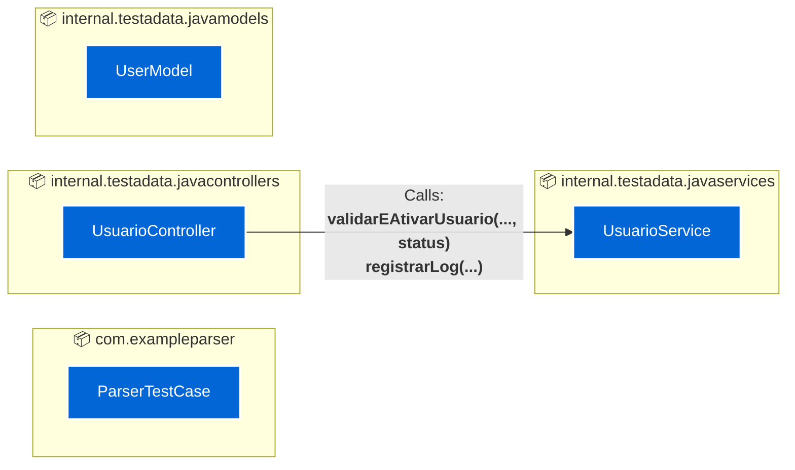

# 🌍 Global Architecture Diagram

> Visão geral de alto nível mostrando as dependências entre todas as classes analisadas e seus respectivos pacotes.

```mermaid
flowchart LR
    classDef classNode fill:#0366d6,stroke:#fff,stroke-width:2px,color:#fff;
    
    
    subgraph com_exampleparser ["📦 com.exampleparser"]
        direction TB
        
        ParserTestCase["ParserTestCase"]:::classNode
        
    end
    
    subgraph internal_testadata_javacontrollers ["📦 internal.testadata.javacontrollers"]
        direction TB
        
        UsuarioController["UsuarioController"]:::classNode
        
    end
    
    subgraph internal_testadata_javamodels ["📦 internal.testadata.javamodels"]
        direction TB
        
        UserModel["UserModel"]:::classNode
        
    end
    
    subgraph internal_testadata_javaservices ["📦 internal.testadata.javaservices"]
        direction TB
        
        UsuarioService["UsuarioService"]:::classNode
        
    end
    

    
    
    
    
    
    
    
    
    
    
    
    
    
    
    
    
    
    
    
    
    
    
    
    
    
    
    
    
    
    
    
    
    
    
    
        
        
            UsuarioController -->|"Calls:<br><b>validarEAtivarUsuario(..., status)<br>registrarLog(...)</b>"| UsuarioService
        
    
    
    
```
