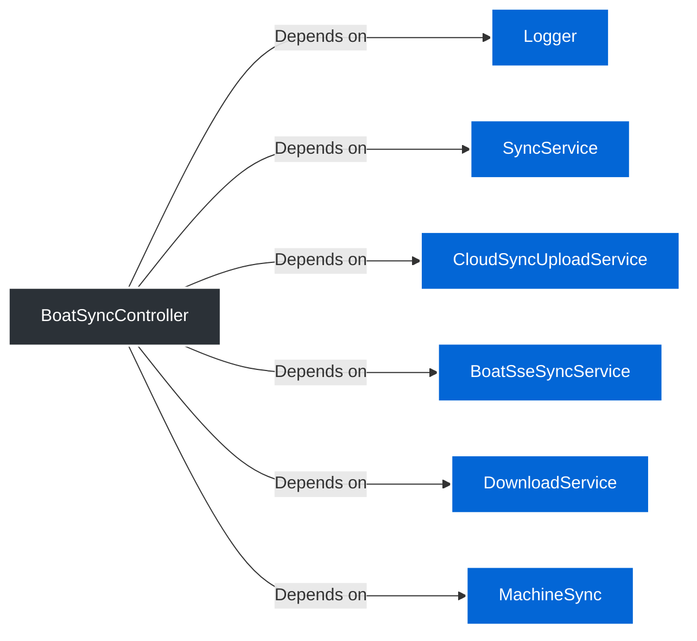

> **@RestController**
# 📄 Technical Specification: `BoatSyncController`

> **Package:** sync
> **Dependencies (Imports):**
> - java.io.IOException
> - java.security.Principal
> - java.util.List
> - java.util.Map
> - java.util.UUID
> - org.slf4j.LoggerFactory
> - org.springframework.http.HttpStatus
> - org.springframework.http.MediaType
> - org.springframework.http.ResponseEntity
> - org.springframework.http.codec.ServerSentEvent
> - org.springframework.web.bind.annotation.GetMapping
> - org.springframework.web.bind.annotation.PathVariable
> - org.springframework.web.bind.annotation.PostMapping
> - org.springframework.web.bind.annotation.RequestBody
> - org.springframework.web.bind.annotation.RequestParam
> - org.springframework.web.bind.annotation.RestController
> - com.rfidbrasil.core.dto.request.SyncRequest
> - com.rfidbrasil.core.dto.response.SyncLastestResponse
> - com.rfidbrasil.core.service.DownloadService
> - com.rfidbrasil.core.service.SyncService
> - com.rfidbrasil.core.service.sync.BoatSseSyncService
> - [com.rfidbrasil.core.service.sync.CloudSyncUploadService](CloudSyncUploadService.md) 🔗
> - com.rfidbrasil.core.service.sync.MachineSync
> - com.rfidbrasil.core.utils.response.ContentLengthResponseBuilder
> - reactor.core.publisher.Flux
> **Automatically generated documentation** by the Geanky tool.

---

## 1. Quick Summary (API & State)
A high-level overview of the class, its internal state, and available methods.

**Internal State & Dependencies:**


- `private static final ` **log** (`Logger`)


- `private final ` **service** (`SyncService`)


- `private final ` **syncService** ([CloudSyncUploadService](CloudSyncUploadService.md)) 🔗


- `private final ` **sseSyncService** (`BoatSseSyncService`)


- `private final ` **downloadService** (`DownloadService`)


- `private final ` **machineSync** (`MachineSync`)


**Available Methods:**
- **subscEmitter(UUID uuid)** ➞ returns `Flux&lt;ServerSentEvent&lt;String&gt;&gt;`
- **portalReadingsSyncPaginated(Long timestamp, Long id, Principal principal)** ➞ returns `ResponseEntity&lt;?&gt;`
- **latestSync(Principal principal)** ➞ returns `ResponseEntity&lt;?&gt;`
- **triggerCloudSync(SyncRequest request, Principal principal)** ➞ returns `ResponseEntity&lt;?&gt;`


---

## 2. Class Dependencies & State
Visual representation of the internal state and external dependencies this class maintains.



---

## 3. Deep Dive (Constructors & Methods)
Expand the sections below to read the exact pseudo-code and business rules.


### 🛠️ Constructors

<details>
<summary><b>BoatSyncController</b>(<i>SyncService</i> service, <i>CloudSyncUploadService</i> syncService, <i>BoatSseSyncService</i> sseSyncService, <i>DownloadService</i> downloadService, <i>MachineSync</i> machineSync) (Click to expand)</summary>

> **Signature:**
> `public BoatSyncController(SyncService service, CloudSyncUploadService syncService, BoatSseSyncService sseSyncService, DownloadService downloadService, MachineSync machineSync)`

**Parameters:**

- **service** (`SyncService`)

- **syncService** (`CloudSyncUploadService`)

- **sseSyncService** (`BoatSseSyncService`)

- **downloadService** (`DownloadService`)

- **machineSync** (`MachineSync`)


**Step-by-Step Logic:**


1. Set &#39;this.service&#39; to &#39;service&#39;

1. Set &#39;this.syncService&#39; to &#39;syncService&#39;

1. Set &#39;this.sseSyncService&#39; to &#39;sseSyncService&#39;

1. Set &#39;this.downloadService&#39; to &#39;downloadService&#39;

1. Set &#39;this.machineSync&#39; to &#39;machineSync&#39;


</details>


### ⚙️ Methods

<details>
<summary><b>subscEmitter</b>(<i>UUID</i> uuid) ➞ `Flux&lt;ServerSentEvent&lt;String&gt;&gt;` (Click to expand)</summary>

> **Signature:**
> `@GetMapping(value = &#34;/events/{uuid}&#34;, produces = MediaType.TEXT_EVENT_STREAM_VALUE)`
> `public Flux&lt;ServerSentEvent&lt;String&gt;&gt; subscEmitter(UUID uuid)`

**Data Flow:**
```mermaid
flowchart TD
    classDef methodNode fill:#0366d6,stroke:#fff,stroke-width:2px,color:#fff;
    classDef callNode fill:#f1f8ff,stroke:#0366d6,color:#24292f;
    classDef ifNode fill:#fff8c5,stroke:#d73a49,color:#24292f;
    classDef retNode fill:#28a745,stroke:#fff,color:#fff;

    START((&#34;Caller&#34;)) --&gt; M_ENTRY[&#34;subscEmitter(UUID uuid)&#34;]:::methodNode
    M_ENTRY --&gt; N1((&#34;Return:&lt;br&gt;Invoke &#39;sseSyncService.subs...&#34;)):::retNode

```

**Parameters:**

- **uuid** (`UUID`)


**Step-by-Step Logic:**


1. Return the result of: Invoke &#39;sseSyncService.subscribe&#39; with parameters: &#39;uuid&#39;


</details>

<details>
<summary><b>portalReadingsSyncPaginated</b>(<i>Long</i> timestamp, <i>Long</i> id, <i>Principal</i> principal) ➞ `ResponseEntity&lt;?&gt;` (Click to expand)</summary>

> **Signature:**
> `@GetMapping(&#34;/portal-readings&#34;)`
> `public ResponseEntity&lt;?&gt; portalReadingsSyncPaginated(Long timestamp, Long id, Principal principal)`

**Data Flow:**
```mermaid
flowchart TD
    classDef methodNode fill:#0366d6,stroke:#fff,stroke-width:2px,color:#fff;
    classDef callNode fill:#f1f8ff,stroke:#0366d6,color:#24292f;
    classDef ifNode fill:#fff8c5,stroke:#d73a49,color:#24292f;
    classDef retNode fill:#28a745,stroke:#fff,color:#fff;

    START((&#34;Caller&#34;)) --&gt; M_ENTRY[&#34;portalReadingsSyncPaginated(Long timestamp, Long id, Principal principal)&#34;]:::methodNode
    M_ENTRY --&gt; N1{&#34;If:&lt;br&gt;Invoke &#39;readings.size&#39; (no parameters...&#34;}:::ifNode
    N1 --&gt; N2((&#34;Return:&lt;br&gt;Invoke &#39;ContentLengthRespon...&#34;)):::retNode

```

**Parameters:**

- **timestamp** (`Long`)

- **id** (`Long`)

- **principal** (`Principal`)


**Step-by-Step Logic:**


1. If Invoke &#39;readings.size&#39; (no parameters) is less than SyncService.MAX_ITEMS plus 1
   then:
      - Return the result of: Invoke &#39;ContentLengthResponseBuilder.createResponse&#39; with parameters: &#39;readings&#39;, &#39;HttpStatus.OK&#39;, &#39;principal&#39;


</details>

<details>
<summary><b>latestSync</b>(<i>Principal</i> principal) ➞ `ResponseEntity&lt;?&gt;` (Click to expand)</summary>

> **Signature:**
> `@GetMapping(&#34;/latest&#34;)`
> `public ResponseEntity&lt;?&gt; latestSync(Principal principal)`

**Data Flow:**
```mermaid
flowchart TD
    classDef methodNode fill:#0366d6,stroke:#fff,stroke-width:2px,color:#fff;
    classDef callNode fill:#f1f8ff,stroke:#0366d6,color:#24292f;
    classDef ifNode fill:#fff8c5,stroke:#d73a49,color:#24292f;
    classDef retNode fill:#28a745,stroke:#fff,color:#fff;

    START((&#34;Caller&#34;)) --&gt; M_ENTRY[&#34;latestSync(Principal principal)&#34;]:::methodNode
    M_ENTRY --&gt; N1((&#34;Return:&lt;br&gt;Invoke &#39;ContentLengthRespon...&#34;)):::retNode

```

**Parameters:**

- **principal** (`Principal`)


**Step-by-Step Logic:**


1. Return the result of: Invoke &#39;ContentLengthResponseBuilder.ok&#39; with parameters: &#39;response&#39;, &#39;principal&#39;


</details>

<details>
<summary><b>triggerCloudSync</b>(<i>SyncRequest</i> request, <i>Principal</i> principal) ➞ `ResponseEntity&lt;?&gt;` (Click to expand)</summary>

> **Signature:**
> `@PostMapping(&#34;/cloud&#34;)`
> `public ResponseEntity&lt;?&gt; triggerCloudSync(SyncRequest request, Principal principal)`

**Data Flow:**
```mermaid
flowchart TD
    classDef methodNode fill:#0366d6,stroke:#fff,stroke-width:2px,color:#fff;
    classDef callNode fill:#f1f8ff,stroke:#0366d6,color:#24292f;
    classDef ifNode fill:#fff8c5,stroke:#d73a49,color:#24292f;
    classDef retNode fill:#28a745,stroke:#fff,color:#fff;

    START((&#34;Caller&#34;)) --&gt; M_ENTRY[&#34;triggerCloudSync(SyncRequest request, Principal principal)&#34;]:::methodNode
    M_ENTRY -.-&gt; END((&#34;End&#34;))

```

**Parameters:**

- **request** (`SyncRequest`)

- **principal** (`Principal`)


**Step-by-Step Logic:**
> *Empty body.*

</details>


