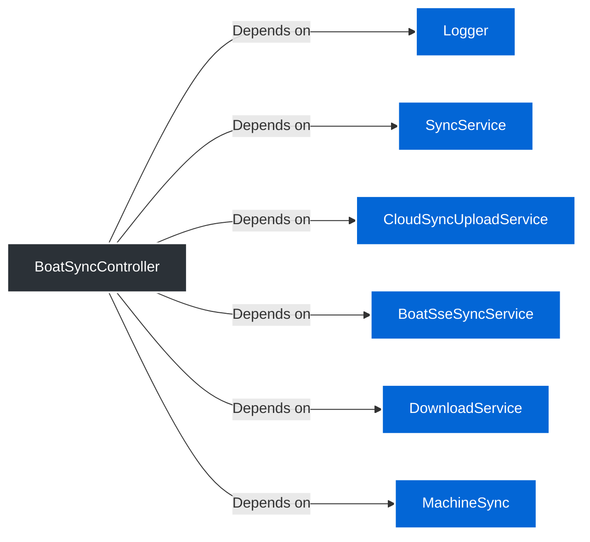
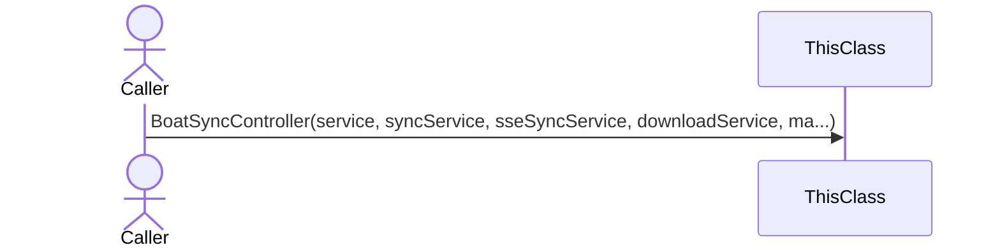
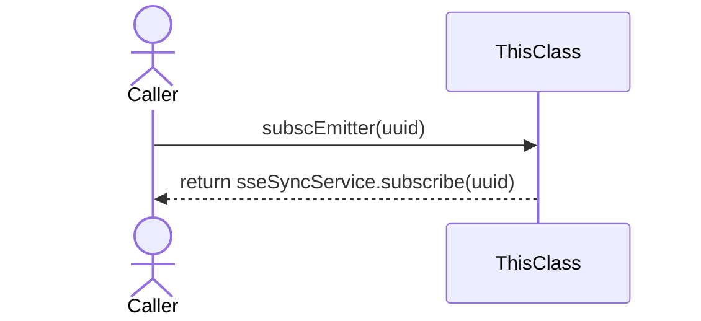
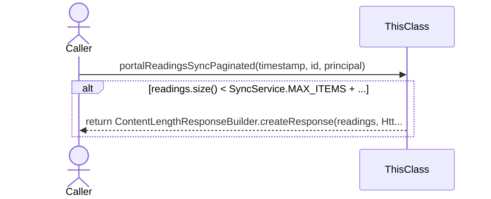
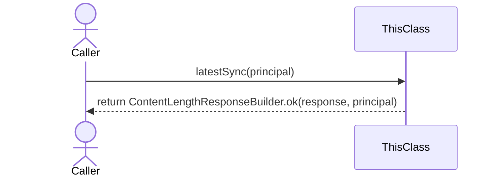
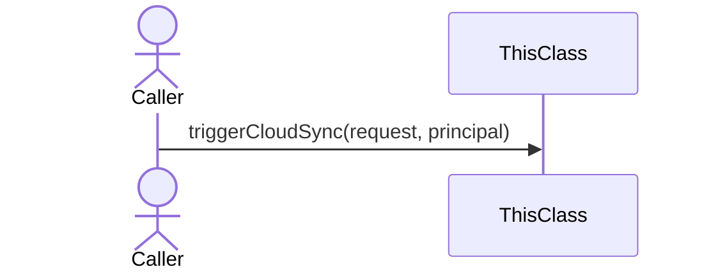

> **@RestController**
# 📄 Technical Specification: `BoatSyncController`

> **Package:** sync
> **Dependencies (Imports):**
> - java.io.IOException
> - java.security.Principal
> - java.util.List
> - java.util.Map
> - java.util.UUID
> - org.slf4j.LoggerFactory
> - org.springframework.http.HttpStatus
> - org.springframework.http.MediaType
> - org.springframework.http.ResponseEntity
> - org.springframework.http.codec.ServerSentEvent
> - org.springframework.web.bind.annotation.GetMapping
> - org.springframework.web.bind.annotation.PathVariable
> - org.springframework.web.bind.annotation.PostMapping
> - org.springframework.web.bind.annotation.RequestBody
> - org.springframework.web.bind.annotation.RequestParam
> - org.springframework.web.bind.annotation.RestController
> - com.rfidbrasil.core.dto.request.SyncRequest
> - com.rfidbrasil.core.dto.response.SyncLastestResponse
> - com.rfidbrasil.core.service.DownloadService
> - com.rfidbrasil.core.service.SyncService
> - com.rfidbrasil.core.service.sync.BoatSseSyncService
> - [com.rfidbrasil.core.service.sync.CloudSyncUploadService](CloudSyncUploadService.md) 🔗
> - com.rfidbrasil.core.service.sync.MachineSync
> - com.rfidbrasil.core.utils.response.ContentLengthResponseBuilder
> - reactor.core.publisher.Flux
> **Automatically generated documentation** by the Geanky tool.

---

## 1. Quick Summary (API & State)
A high-level overview of the class, its internal state, and available methods.

**Internal State & Dependencies:**

- `private static final ` **log** (`Logger`)

- `private final ` **service** (`SyncService`)

- `private final ` **syncService** ([CloudSyncUploadService](CloudSyncUploadService.md)) 🔗

- `private final ` **sseSyncService** (`BoatSseSyncService`)

- `private final ` **downloadService** (`DownloadService`)

- `private final ` **machineSync** (`MachineSync`)

**Available Methods:**
- **subscEmitter(UUID uuid)** ➞ returns `Flux<ServerSentEvent<String>>`
- **portalReadingsSyncPaginated(Long timestamp, Long id, Principal principal)** ➞ returns `ResponseEntity<?>`
- **latestSync(Principal principal)** ➞ returns `ResponseEntity<?>`
- **triggerCloudSync(SyncRequest request, Principal principal)** ➞ returns `ResponseEntity<?>`

---

## 2. Class Dependencies & State
Visual representation of the internal state and external dependencies this class maintains.

---

## 3. Deep Dive (Constructors & Methods)
Expand the sections below to read the exact pseudo-code and business rules.

### 🛠️ Constructors

<b>BoatSyncController</b>(<i>SyncService</i> service, <i>CloudSyncUploadService</i> syncService, <i>BoatSseSyncService</i> sseSyncService, <i>DownloadService</i> downloadService, <i>MachineSync</i> machineSync) (Click to expand)

> **Signature:**
> `public BoatSyncController(SyncService service, CloudSyncUploadService syncService, BoatSseSyncService sseSyncService, DownloadService downloadService, MachineSync machineSync)`

**Sequence Diagram:**

**Parameters:**

- **service** (`SyncService`)

- **syncService** (`CloudSyncUploadService`)

- **sseSyncService** (`BoatSseSyncService`)

- **downloadService** (`DownloadService`)

- **machineSync** (`MachineSync`)

**Step-by-Step Logic:**

1. Set 'this.service' to 'service'

1. Set 'this.syncService' to 'syncService'

1. Set 'this.sseSyncService' to 'sseSyncService'

1. Set 'this.downloadService' to 'downloadService'

1. Set 'this.machineSync' to 'machineSync'

### ⚙️ Methods

<b>subscEmitter</b>(<i>UUID</i> uuid) ➞ `Flux<ServerSentEvent<String>>` (Click to expand)

> **Signature:**
> `@GetMapping(value = "/events/{uuid}", produces = MediaType.TEXT_EVENT_STREAM_VALUE)`
> `public Flux<ServerSentEvent<String>> subscEmitter(UUID uuid)`

**Sequence Diagram:**

**Parameters:**

- **uuid** (`UUID`)

**Step-by-Step Logic:**

1. Return the result of: Invoke 'sseSyncService.subscribe' with parameters: 'uuid'

<b>portalReadingsSyncPaginated</b>(<i>Long</i> timestamp, <i>Long</i> id, <i>Principal</i> principal) ➞ `ResponseEntity<?>` (Click to expand)

> **Signature:**
> `@GetMapping("/portal-readings")`
> `public ResponseEntity<?> portalReadingsSyncPaginated(Long timestamp, Long id, Principal principal)`

**Sequence Diagram:**

**Parameters:**

- **timestamp** (`Long`)

- **id** (`Long`)

- **principal** (`Principal`)

**Step-by-Step Logic:**

1. If Invoke 'readings.size' (no parameters) is less than SyncService.MAX_ITEMS plus 1
   then:
      - Return the result of: Invoke 'ContentLengthResponseBuilder.createResponse' with parameters: 'readings', 'HttpStatus.OK', 'principal'

<b>latestSync</b>(<i>Principal</i> principal) ➞ `ResponseEntity<?>` (Click to expand)

> **Signature:**
> `@GetMapping("/latest")`
> `public ResponseEntity<?> latestSync(Principal principal)`

**Sequence Diagram:**

**Parameters:**

- **principal** (`Principal`)

**Step-by-Step Logic:**

1. Return the result of: Invoke 'ContentLengthResponseBuilder.ok' with parameters: 'response', 'principal'

<b>triggerCloudSync</b>(<i>SyncRequest</i> request, <i>Principal</i> principal) ➞ `ResponseEntity<?>` (Click to expand)

> **Signature:**
> `@PostMapping("/cloud")`
> `public ResponseEntity<?> triggerCloudSync(SyncRequest request, Principal principal)`

**Sequence Diagram:**

**Parameters:**

- **request** (`SyncRequest`)

- **principal** (`Principal`)

**Step-by-Step Logic:**
> *Empty body.*

