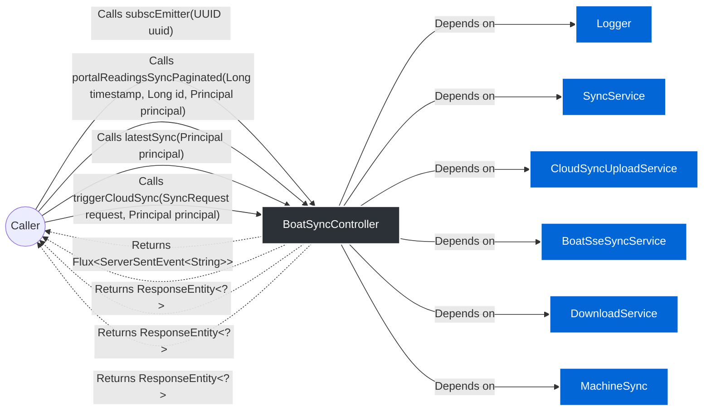

# `BoatSyncController`

> **Package:** sync
> **Dependencies (Imports):**
> - java.io.IOException
> - java.security.Principal
> - java.util.List
> - java.util.Map
> - java.util.UUID
> - org.slf4j.LoggerFactory
> - org.springframework.http.HttpStatus
> - org.springframework.http.MediaType
> - org.springframework.http.ResponseEntity
> - org.springframework.http.codec.ServerSentEvent
> - org.springframework.web.bind.annotation.GetMapping
> - org.springframework.web.bind.annotation.PathVariable
> - org.springframework.web.bind.annotation.PostMapping
> - org.springframework.web.bind.annotation.RequestBody
> - org.springframework.web.bind.annotation.RequestParam
> - org.springframework.web.bind.annotation.RestController
> - com.rfidbrasil.core.dto.request.SyncRequest
> - com.rfidbrasil.core.dto.response.SyncLastestResponse
> - com.rfidbrasil.core.service.DownloadService
> - com.rfidbrasil.core.service.SyncService
> - com.rfidbrasil.core.service.sync.BoatSseSyncService
> - com.rfidbrasil.core.service.sync.CloudSyncUploadService
> - com.rfidbrasil.core.service.sync.MachineSync
> - com.rfidbrasil.core.utils.response.ContentLengthResponseBuilder
> - reactor.core.publisher.Flux
> 

---

## 1. Quick Summary (API & State)
A high-level overview of the class, its internal state, and available methods.

**Internal State & Dependencies:**

- `private static final ` **log** ([Logger](Logger.md)) 🔗

- `private final ` **service** ([SyncService](SyncService.md)) 🔗

- `private final ` **syncService** ([CloudSyncUploadService](CloudSyncUploadService.md)) 🔗

- `private final ` **sseSyncService** ([BoatSseSyncService](BoatSseSyncService.md)) 🔗

- `private final ` **downloadService** ([DownloadService](DownloadService.md)) 🔗

- `private final ` **machineSync** ([MachineSync](MachineSync.md)) 🔗

**Available Methods:**
- **subscEmitter(UUID uuid)** ➞ returns `Flux&lt;ServerSentEvent&lt;String&gt;&gt;`
- **portalReadingsSyncPaginated(Long timestamp, Long id, Principal principal)** ➞ returns `ResponseEntity&lt;?&gt;`
- **latestSync(Principal principal)** ➞ returns `ResponseEntity&lt;?&gt;`
- **triggerCloudSync(SyncRequest request, Principal principal)** ➞ returns `ResponseEntity&lt;?&gt;`

---

## 2. Architecture & Data Flow Diagram
Visual representation of how data enters the class, internal state, and external dependencies.

---

## 3. Deep Dive (Constructors & Methods)
Expand the sections below to read the exact pseudo-code and business rules.

### 🛠️ Constructors

<b>BoatSyncController</b>(<i>SyncService</i> service, <i>CloudSyncUploadService</i> syncService, <i>BoatSseSyncService</i> sseSyncService, <i>DownloadService</i> downloadService, <i>MachineSync</i> machineSync) (Click to expand)

**Parameters:**

- **service** (`SyncService`)

- **syncService** (`CloudSyncUploadService`)

- **sseSyncService** (`BoatSseSyncService`)

- **downloadService** (`DownloadService`)

- **machineSync** (`MachineSync`)

**Step-by-Step Logic:**

1. Set &#39;this.service&#39; to &#39;service&#39;

1. Set &#39;this.syncService&#39; to &#39;syncService&#39;

1. Set &#39;this.sseSyncService&#39; to &#39;sseSyncService&#39;

1. Set &#39;this.downloadService&#39; to &#39;downloadService&#39;

1. Set &#39;this.machineSync&#39; to &#39;machineSync&#39;

### ⚙️ Methods

<b>subscEmitter</b>(<i>UUID</i> uuid) ➞ `Flux&lt;ServerSentEvent&lt;String&gt;&gt;` (Click to expand)

> **Signature:** `@GetMapping(value = &#34;/events/{uuid}&#34;, produces = MediaType.TEXT_EVENT_STREAM_VALUE) public Flux&lt;ServerSentEvent&lt;String&gt;&gt; subscEmitter(UUID uuid)`

**Parameters:**

- **uuid** (`UUID`)

**Step-by-Step Logic:**

1. Return the result of: Invoke &#39;sseSyncService.subscribe&#39; with parameters: &#39;uuid&#39;

<b>portalReadingsSyncPaginated</b>(<i>Long</i> timestamp, <i>Long</i> id, <i>Principal</i> principal) ➞ `ResponseEntity&lt;?&gt;` (Click to expand)

> **Signature:** `@GetMapping(&#34;/portal-readings&#34;) public ResponseEntity&lt;?&gt; portalReadingsSyncPaginated(Long timestamp, Long id, Principal principal)`

**Parameters:**

- **timestamp** (`Long`)

- **id** (`Long`)

- **principal** (`Principal`)

**Step-by-Step Logic:**

1. If Invoke &#39;readings.size&#39; (no parameters) is less than SyncService.MAX_ITEMS plus 1
   then:
      - Return the result of: Invoke &#39;ContentLengthResponseBuilder.createResponse&#39; with parameters: &#39;readings&#39;, &#39;HttpStatus.OK&#39;, &#39;principal&#39;

<b>latestSync</b>(<i>Principal</i> principal) ➞ `ResponseEntity&lt;?&gt;` (Click to expand)

> **Signature:** `@GetMapping(&#34;/latest&#34;) public ResponseEntity&lt;?&gt; latestSync(Principal principal)`

**Parameters:**

- **principal** (`Principal`)

**Step-by-Step Logic:**

1. Return the result of: Invoke &#39;ContentLengthResponseBuilder.ok&#39; with parameters: &#39;response&#39;, &#39;principal&#39;

<b>triggerCloudSync</b>(<i>SyncRequest</i> request, <i>Principal</i> principal) ➞ `ResponseEntity&lt;?&gt;` (Click to expand)

> **Signature:** `@PostMapping(&#34;/cloud&#34;) public ResponseEntity&lt;?&gt; triggerCloudSync(SyncRequest request, Principal principal)`

**Parameters:**

- **request** (`SyncRequest`)

- **principal** (`Principal`)

**Step-by-Step Logic:**
> *Empty body.*

