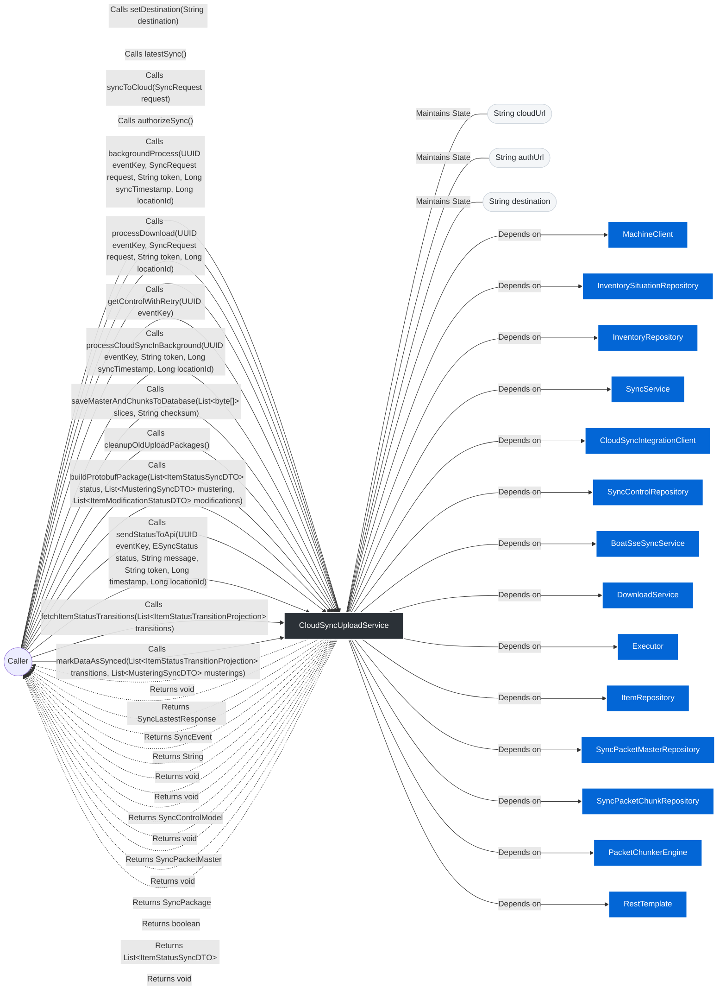

> **@Slf4j**
> **@Service**
# 📄 Technical Specification: `CloudSyncUploadService`

> **Package:** sync
> **Dependencies (Imports):**
> - java.net.http.HttpHeaders
> - java.time.Instant
> - java.util.ArrayList
> - java.util.List
> - java.util.Optional
> - java.util.UUID
> - java.util.concurrent.CompletableFuture
> - java.util.concurrent.CompletionException
> - java.util.concurrent.Executor
> - java.util.stream.Collectors
> - org.springframework.beans.factory.annotation.Qualifier
> - org.springframework.beans.factory.annotation.Value
> - org.springframework.http.HttpEntity
> - org.springframework.http.HttpMethod
> - org.springframework.http.HttpStatus
> - org.springframework.http.MediaType
> - org.springframework.http.ResponseEntity
> - org.springframework.http.client.SimpleClientHttpRequestFactory
> - org.springframework.stereotype.Service
> - org.springframework.web.client.HttpClientErrorException
> - org.springframework.web.client.RestTemplate
> - com.fasterxml.jackson.databind.JsonNode
> - com.fasterxml.jackson.databind.ObjectMapper
> - com.rfidbrasil.core.dto.ItemModificationStatusDTO
> - com.rfidbrasil.core.dto.ItemStatusSyncDTO
> - com.rfidbrasil.core.dto.MusteringSituationSyncDTO
> - com.rfidbrasil.core.dto.MusteringSyncDTO
> - com.rfidbrasil.core.dto.projection.ItemStatusTransitionProjection
> - com.rfidbrasil.core.dto.request.SyncRequest
> - com.rfidbrasil.core.dto.request.UpdateSyncStatusRequest
> - com.rfidbrasil.core.dto.response.PingSyncResponse
> - com.rfidbrasil.core.dto.response.SyncEvent
> - com.rfidbrasil.core.dto.response.SyncLastestResponse
> - com.rfidbrasil.core.enums.EPacketStatus
> - com.rfidbrasil.core.enums.ESyncStatus
> - com.rfidbrasil.core.exception.throwable.AppException
> - com.rfidbrasil.core.model.sync.SyncControlModel
> - com.rfidbrasil.core.model.sync.SyncPacketChunk
> - com.rfidbrasil.core.model.sync.SyncPacketMaster
> - com.rfidbrasil.core.repository.InventoryRepository
> - com.rfidbrasil.core.repository.InventorySituationRepository
> - com.rfidbrasil.core.repository.ItemRepository
> - com.rfidbrasil.core.repository.LocationRepository
> - com.rfidbrasil.core.repository.SyncControlRepository
> - com.rfidbrasil.core.repository.SyncPacketChunkRepository
> - com.rfidbrasil.core.repository.SyncPacketMasterRepository
> - com.rfidbrasil.core.service.DownloadService
> - com.rfidbrasil.core.service.SyncService
> - com.rfidbrasil.core.service.sync.engine.PacketChunkerEngine
> - com.rfidbrasil.core.service.sync.proto.ItemModificationSync
> - com.rfidbrasil.core.service.sync.proto.ItemStatusSync
> - com.rfidbrasil.core.service.sync.proto.MusteringSituationSync
> - com.rfidbrasil.core.service.sync.proto.MusteringSync
> - com.rfidbrasil.core.service.sync.proto.SyncPackage
> - lombok.extern.slf4j.Slf4j
> **Automatically generated documentation** by the Geanky tool.

---

## 1. Quick Summary (API & State)
A high-level overview of the class, its internal state, and available methods.

**Internal State & Dependencies:**

- `private final ` **machineClient** (`MachineClient`)

- `private final ` **situationRepository** (`InventorySituationRepository`)

- `private final ` **inventoryRepository** (`InventoryRepository`)

- `private final ` **musteringBuilderService** (`SyncService`)

- `private final ` **httpClient** (`CloudSyncIntegrationClient`)

- `private final ` **syncControlRepository** (`SyncControlRepository`)

- `private final ` **sseSyncService** (`BoatSseSyncService`)

- `private final ` **downloadService** (`DownloadService`)

- `private final ` **parallelSyncExecutor** (`Executor`)

- `private final ` **itemRepository** (`ItemRepository`)

- `private final ` **masterRepository** (`SyncPacketMasterRepository`)

- `private final ` **chunkRepository** (`SyncPacketChunkRepository`)

- `private final ` **chunkerEngine** (`PacketChunkerEngine`)

- `private final ` **restTemplate** (`RestTemplate`)

- `@Value(&#34;${cloud.api.sync.url:http://cloud:8889/api/v2/sync}&#34;)` `private ` **cloudUrl** (`String`)

- `@Value(&#34;${cloud.api.auth.url:http://cloud:8889/api/v2/auth}&#34;)` `private ` **authUrl** (`String`)

- `private ` **destination** (`String`)

**Available Methods:**
- **setDestination(String destination)** ➞ returns `void`
- **latestSync()** ➞ returns `SyncLastestResponse`
- **syncToCloud(SyncRequest request)** ➞ returns `SyncEvent`
- **authorizeSync()** ➞ returns `String`
- **backgroundProcess(UUID eventKey, SyncRequest request, String token, Long syncTimestamp, Long locationId)** ➞ returns `void`
- **processDownload(UUID eventKey, SyncRequest request, String token, Long locationId)** ➞ returns `void`
- **getControlWithRetry(UUID eventKey)** ➞ returns `SyncControlModel`
- **processCloudSyncInBackground(UUID eventKey, String token, Long syncTimestamp, Long locationId)** ➞ returns `void`
- **saveMasterAndChunksToDatabase(List&lt;byte[]&gt; slices, String checksum)** ➞ returns `SyncPacketMaster`
- **cleanupOldUploadPackages()** ➞ returns `void`
- **buildProtobufPackage(List&lt;ItemStatusSyncDTO&gt; status, List&lt;MusteringSyncDTO&gt; mustering, List&lt;ItemModificationStatusDTO&gt; modifications)** ➞ returns `SyncPackage`
- **sendStatusToApi(UUID eventKey, ESyncStatus status, String message, String token, Long timestamp, Long locationId)** ➞ returns `boolean`
- **fetchItemStatusTransitions(List&lt;ItemStatusTransitionProjection&gt; transitions)** ➞ returns `List&lt;ItemStatusSyncDTO&gt;`
- **markDataAsSynced(List&lt;ItemStatusTransitionProjection&gt; transitions, List&lt;MusteringSyncDTO&gt; musterings)** ➞ returns `void`

---

## 2. Architecture & Data Flow Diagram
Visual representation of how data enters the class, internal state, and external dependencies.

---

## 3. Deep Dive (Constructors & Methods)
Expand the sections below to read the exact pseudo-code and business rules.

### 🛠️ Constructors

<b>CloudSyncUploadService</b>(<i>InventorySituationRepository</i> situationRepository, <i>LocationRepository</i> locationRepository, <i>InventoryRepository</i> inventoryRepository, <i>SyncService</i> musteringBuilderService, <i>CloudSyncIntegrationClient</i> httpClient, <i>SyncControlRepository</i> syncControlRepository, <i>BoatSseSyncService</i> sseSyncService, <i>RestTemplate</i> restTemplate, <i>DownloadService</i> downloadService, <i>ItemRepository</i> itemRepository, <i>PacketChunkerEngine</i> chunkerEngine, <i>SyncPacketChunkRepository</i> syncPacketChunkRepository, <i>SyncPacketMasterRepository</i> syncPacketMasterRepository, <i>Executor</i> parallelSyncExecutor, <i>MachineClient</i> machineClient) (Click to expand)

> **Signature:**
> `public CloudSyncUploadService(InventorySituationRepository situationRepository, LocationRepository locationRepository, InventoryRepository inventoryRepository, SyncService musteringBuilderService, CloudSyncIntegrationClient httpClient, SyncControlRepository syncControlRepository, BoatSseSyncService sseSyncService, RestTemplate restTemplate, DownloadService downloadService, ItemRepository itemRepository, PacketChunkerEngine chunkerEngine, SyncPacketChunkRepository syncPacketChunkRepository, SyncPacketMasterRepository syncPacketMasterRepository, Executor parallelSyncExecutor, MachineClient machineClient)`

**Parameters:**

- **situationRepository** (`InventorySituationRepository`)

- **locationRepository** (`LocationRepository`)

- **inventoryRepository** (`InventoryRepository`)

- **musteringBuilderService** (`SyncService`)

- **httpClient** (`CloudSyncIntegrationClient`)

- **syncControlRepository** (`SyncControlRepository`)

- **sseSyncService** (`BoatSseSyncService`)

- **restTemplate** (`RestTemplate`)

- **downloadService** (`DownloadService`)

- **itemRepository** (`ItemRepository`)

- **chunkerEngine** (`PacketChunkerEngine`)

- **syncPacketChunkRepository** (`SyncPacketChunkRepository`)

- **syncPacketMasterRepository** (`SyncPacketMasterRepository`)

- **parallelSyncExecutor** (`Executor`)

- **machineClient** (`MachineClient`)

**Step-by-Step Logic:**

1. Set &#39;this.situationRepository&#39; to &#39;situationRepository&#39;

1. Set &#39;this.inventoryRepository&#39; to &#39;inventoryRepository&#39;

1. Set &#39;this.musteringBuilderService&#39; to &#39;musteringBuilderService&#39;

1. Set &#39;this.httpClient&#39; to &#39;httpClient&#39;

1. Set &#39;this.syncControlRepository&#39; to &#39;syncControlRepository&#39;

1. Set &#39;this.sseSyncService&#39; to &#39;sseSyncService&#39;

1. Set &#39;this.parallelSyncExecutor&#39; to &#39;parallelSyncExecutor&#39;

1. Set &#39;this.restTemplate&#39; to &#39;restTemplate&#39;

1. Set &#39;this.downloadService&#39; to &#39;downloadService&#39;

1. Set &#39;this.itemRepository&#39; to &#39;itemRepository&#39;

1. Set &#39;this.machineClient&#39; to &#39;machineClient&#39;

1. Set &#39;this.chunkerEngine&#39; to &#39;chunkerEngine&#39;

1. Set &#39;this.chunkRepository&#39; to &#39;syncPacketChunkRepository&#39;

1. Set &#39;this.masterRepository&#39; to &#39;syncPacketMasterRepository&#39;

### ⚙️ Methods

<b>setDestination</b>(<i>String</i> destination) ➞ `void` (Click to expand)

> **Signature:**
> `public void setDestination(String destination)`

**Parameters:**

- **destination** (`String`)

**Step-by-Step Logic:**

1. Set &#39;this.destination&#39; to &#39;destination&#39;

<b>latestSync</b>() ➞ `SyncLastestResponse` (Click to expand)

> **Signature:**
> `public SyncLastestResponse latestSync()`

**Parameters:**
> *None.*

**Step-by-Step Logic:**

1. If Invoke &#39;syncModelOpt.isEmpty&#39; (no parameters)
   then:
      - Return the result of: new SyncLastestResponse(&#34;&#34;, ESyncStatus.NONE, 0L, &#34;&#34;)

1. Return the result of: new SyncLastestResponse(eventKey, syncControlModel.getStatus(),
                timestamp, syncControlModel.getErrorMessage())

<b>syncToCloud</b>(<i>SyncRequest</i> request) ➞ `SyncEvent` (Click to expand)

> **Signature:**
> `public SyncEvent syncToCloud(SyncRequest request)`

**Parameters:**

- **request** (`SyncRequest`)

**Step-by-Step Logic:**

1. Invoke &#39;log.info&#39; with parameters: &#39;&#34;sync iniciado&#34;&#39;

1. If Invoke &#39;ESyncStatus.UPLOAD_IN_PROGRESS.equals&#39; with parameters: &#39;Invoke &#39;control.getStatus&#39; (no parameters)&#39; OR Invoke &#39;ESyncStatus.DOWNLOAD_IN_PROGRESS.equals&#39; with parameters: &#39;Invoke &#39;control.getStatus&#39; (no parameters)&#39; OR Invoke &#39;ESyncStatus.IN_PROGRESS.equals&#39; with parameters: &#39;Invoke &#39;control.getStatus&#39; (no parameters)&#39;
   then:
      - Invoke &#39;sseSyncService.sendSyncStatusOnChange&#39; with parameters: &#39;Invoke &#39;control.getEventKey&#39; (no parameters)&#39;, &#39;&#34;Sync já em andamento...&#34;&#39;, &#39;Invoke &#39;control.getStatus&#39; (no parameters)&#39;
      - Return the result of: new SyncEvent(control.getEventKey().toString(), control.getStatus(), lastSync)

1. If Invoke &#39;request.getEventKey&#39; (no parameters) is not equal to null AND !request.getEventKey().trim().isEmpty()
   then:
      - Set &#39;targetEventKey&#39; to &#39;Invoke &#39;UUID.fromString&#39; with parameters: &#39;Invoke &#39;request.getEventKey&#39; (no parameters)&#39;&#39;

1. Invoke &#39;newControl.setEventKey&#39; with parameters: &#39;targetEventKey&#39;

1. Invoke &#39;newControl.setStatus&#39; with parameters: &#39;ESyncStatus.UPLOAD_IN_PROGRESS&#39;

1. Invoke &#39;newControl.setLastSyncAt&#39; with parameters: &#39;lastSuccessfulSyncDate&#39;

1. Invoke &#39;newControl.setErrorMessage&#39; with parameters: &#39;&#34;&#34;&#39;

1. If Invoke &#39;newControl.getCreatedAt&#39; (no parameters) is equal to null
   then:
      - Invoke &#39;newControl.setCreatedAt&#39; with parameters: &#39;new java.util.Date()&#39;

1. Invoke &#39;syncControlRepository.saveAndFlush&#39; with parameters: &#39;newControl&#39;

1. Invoke &#39;sseSyncService.sendSyncStatusOnChange&#39; with parameters: &#39;eventKey&#39;, &#39;&#34;&#34;&#39;, &#39;ESyncStatus.IN_PROGRESS&#39;

1. Invoke &#39;backgroundProcess&#39; with parameters: &#39;eventKey&#39;, &#39;request&#39;, &#39;token&#39;, &#39;syncTimestamp&#39;, &#39;Invoke &#39;request.getLocationId&#39; (no parameters)&#39;

1. Invoke &#39;log.info&#39; with parameters: &#39;&#34;[SYNC] Retornando eventKey {} para o frontend conectar no SSE...&#34;&#39;, &#39;eventKey&#39;

1. Return the result of: new SyncEvent(eventKey.toString(), ESyncStatus.IN_PROGRESS, syncTimestamp)

<b>authorizeSync</b>() ➞ `String` (Click to expand)

> **Signature:**
> `public String authorizeSync()`

**Parameters:**
> *None.*

**Step-by-Step Logic:**

1. Invoke &#39;headers.setContentType&#39; with parameters: &#39;MediaType.APPLICATION_JSON&#39;

<b>backgroundProcess</b>(<i>UUID</i> eventKey, <i>SyncRequest</i> request, <i>String</i> token, <i>Long</i> syncTimestamp, <i>Long</i> locationId) ➞ `void` (Click to expand)

> **Signature:**
> `private void backgroundProcess(UUID eventKey, SyncRequest request, String token, Long syncTimestamp, Long locationId)`

**Parameters:**

- **eventKey** (`UUID`)

- **request** (`SyncRequest`)

- **token** (`String`)

- **syncTimestamp** (`Long`)

- **locationId** (`Long`)

**Step-by-Step Logic:**

1. Invoke &#39;Invoke &#39;Invoke &#39;Invoke &#39;CompletableFuture.runAsync&#39; with parameters: &#39;() -&gt; {
                    try {
                        processCloudSyncInBackground(eventKey, token, syncTimestamp, locationId);
                    } catch (Exception e) {
                        throw new CompletionException(e);
                    }
                }&#39;, &#39;parallelSyncExecutor&#39;.thenRunAsync&#39; with parameters: &#39;() -&gt; {
                    try {
                        SyncControlModel control = getControlWithRetry(eventKey);
                        control.setStatus(ESyncStatus.DOWNLOAD_IN_PROGRESS);
                        syncControlRepository.save(control);
                        sseSyncService.sendSyncStatusOnChange(eventKey,
                                &#34;Upload concluído. Verificando novidades na Nuvem...&#34;,
                                ESyncStatus.DOWNLOAD_IN_PROGRESS);

                        log.info(&#34;[SYNC-BACKGROUND] Iniciando Fase 2: DOWNLOAD. Verificando nuvem...&#34;);
                        PingSyncResponse ping = httpClient.pingCloud(token, this.destination, syncTimestamp);

                        if (ping != null &amp;&amp; ping.isDownloadReady()) {
                            log.info(&#34;[SYNC-BACKGROUND] Nuvem sinalizou que há dados. Baixando...&#34;);
                            request.setTimestamp(ping.getTimestampToDownload());
                            processDownload(eventKey, request, token, locationId);
                        } else {
                            log.info(&#34;[SYNC-BACKGROUND] Nenhuma novidade na nuvem. O barco já está atualizado!&#34;);
                        }

                    } catch (Exception e) {
                        throw new CompletionException(&#34;Falha na etapa de Download: &#34; &#43; e.getMessage(), e);
                    }
                }&#39;, &#39;parallelSyncExecutor&#39;.thenRun&#39; with parameters: &#39;() -&gt; {
                    SyncControlModel control = getControlWithRetry(eventKey);

                    Instant now = Instant.now();
                    control.setStatus(ESyncStatus.SUCCESS_PENDING);
                    control.setErrorMessage(&#34;&#34;);
                    control.setLastSyncAt(now);
                    control = syncControlRepository.saveAndFlush(control);
                    sseSyncService.sendSyncStatusOnChange(eventKey, &#34;&#34;, ESyncStatus.SUCCESS);

                    boolean sendApiSuccess = sendStatusToApi(eventKey, ESyncStatus.SUCCESS, &#34;&#34;, token,
                            now.toEpochMilli(),
                            locationId);
                    boolean sendMachineSuccess = machineClient.sendSuccessSync(
                            this.destination == null ? cloudUrl : this.destination,
                            eventKey.toString(),
                            now.toEpochMilli());
                    if (sendApiSuccess &amp;&amp; sendMachineSuccess) {
                        control.setStatus(ESyncStatus.SUCCESS);
                        syncControlRepository.save(control);
                    } else {
                        log.error(
                                &#34;Error ao avisar sucesso para api ou machine, na proxima iteracao do machine havera outra tentativa&#34;);
                    }

                }&#39;.exceptionally&#39; with parameters: &#39;ex -&gt; {
                    Throwable rootCause = ex.getCause() != null ? ex.getCause() : ex;
                    log.error(&#34;[SYNC-BACKGROUND] Erro durante a sincronização: {}&#34;, rootCause.getMessage(), rootCause);

                    try {
                        SyncControlModel control = getControlWithRetry(eventKey);
                        control.setStatus(ESyncStatus.FAILED_PENDING);
                        String errorMsg = rootCause.getMessage() != null ? rootCause.getMessage() : &#34;Erro desconhecido&#34;;
                        control.setErrorMessage(errorMsg.length() &gt; 1000 ? errorMsg.substring(0, 1000) : errorMsg);
                        control = syncControlRepository.saveAndFlush(control);
                        sseSyncService.sendSyncStatusOnChange(eventKey, rootCause.getMessage(), ESyncStatus.FAILED);
                        boolean sendApiStatusSuccessfully = sendStatusToApi(eventKey, ESyncStatus.FAILED,
                                rootCause.getMessage(), token,
                                0L, locationId);

                        if (sendApiStatusSuccessfully) {
                            control.setStatus(ESyncStatus.FAILED);
                            syncControlRepository.save(control);
                        } else {
                            log.error(
                                    &#34;Error ao avisar falha para api, na proxima iteracao do machine havera outra tentativa&#34;);
                        }

                    } catch (Exception dbEx) {
                        log.error(&#34;[SYNC-BACKGROUND] Falha crítica ao salvar status FAILED: {}&#34;, dbEx.getMessage());
                    }
                    return null;
                }&#39;

<b>processDownload</b>(<i>UUID</i> eventKey, <i>SyncRequest</i> request, <i>String</i> token, <i>Long</i> locationId) ➞ `void` (Click to expand)

> **Signature:**
> `private void processDownload(UUID eventKey, SyncRequest request, String token, Long locationId)`

**Parameters:**

- **eventKey** (`UUID`)

- **request** (`SyncRequest`)

- **token** (`String`)

- **locationId** (`Long`)

**Step-by-Step Logic:**
> *Empty body.*

<b>getControlWithRetry</b>(<i>UUID</i> eventKey) ➞ `SyncControlModel` (Click to expand)

> **Signature:**
> `private SyncControlModel getControlWithRetry(UUID eventKey)`

**Parameters:**

- **eventKey** (`UUID`)

**Step-by-Step Logic:**
> *Empty body.*

<b>processCloudSyncInBackground</b>(<i>UUID</i> eventKey, <i>String</i> token, <i>Long</i> syncTimestamp, <i>Long</i> locationId) ➞ `void` (Click to expand)

> **Signature:**
> `private void processCloudSyncInBackground(UUID eventKey, String token, Long syncTimestamp, Long locationId)`

**Parameters:**

- **eventKey** (`UUID`)

- **token** (`String`)

- **syncTimestamp** (`Long`)

- **locationId** (`Long`)

**Step-by-Step Logic:**

1. Invoke &#39;log.info&#39; with parameters: &#39;&#34;[SYNC-BACKGROUND] Iniciando processamento em background para o eventKey: {}&#34;&#39;, &#39;eventKey&#39;

<b>saveMasterAndChunksToDatabase</b>(<i>List&lt;byte[]&gt;</i> slices, <i>String</i> checksum) ➞ `SyncPacketMaster` (Click to expand)

> **Signature:**
> `private SyncPacketMaster saveMasterAndChunksToDatabase(List&lt;byte[]&gt; slices, String checksum)`

**Parameters:**

- **slices** (`List&lt;byte[]&gt;`)

- **checksum** (`String`)

**Step-by-Step Logic:**

1. Invoke &#39;master.setId&#39; with parameters: &#39;Invoke &#39;UUID.randomUUID&#39; (no parameters)&#39;

1. Invoke &#39;master.setStatus&#39; with parameters: &#39;EPacketStatus.PENDING&#39;

1. Invoke &#39;master.setTotalChunks&#39; with parameters: &#39;Invoke &#39;slices.size&#39; (no parameters)&#39;

1. Invoke &#39;master.setProcessedChunks&#39; with parameters: &#39;0&#39;

1. Invoke &#39;master.setChecksum&#39; with parameters: &#39;checksum&#39;

1. Invoke &#39;master.setNextRetryAt&#39; with parameters: &#39;Invoke &#39;Instant.now&#39; (no parameters)&#39;

1. Invoke &#39;master.setChunks&#39; with parameters: &#39;chunks&#39;

1. Return the result of: Invoke &#39;masterRepository.save&#39; with parameters: &#39;master&#39;

<b>cleanupOldUploadPackages</b>() ➞ `void` (Click to expand)

> **Signature:**
> `private void cleanupOldUploadPackages()`

**Parameters:**
> *None.*

**Step-by-Step Logic:**
> *Empty body.*

<b>buildProtobufPackage</b>(<i>List&lt;ItemStatusSyncDTO&gt;</i> status, <i>List&lt;MusteringSyncDTO&gt;</i> mustering, <i>List&lt;ItemModificationStatusDTO&gt;</i> modifications) ➞ `SyncPackage` (Click to expand)

> **Signature:**
> `private SyncPackage buildProtobufPackage(List&lt;ItemStatusSyncDTO&gt; status, List&lt;MusteringSyncDTO&gt; mustering, List&lt;ItemModificationStatusDTO&gt; modifications)`

**Parameters:**

- **status** (`List&lt;ItemStatusSyncDTO&gt;`)

- **mustering** (`List&lt;MusteringSyncDTO&gt;`)

- **modifications** (`List&lt;ItemModificationStatusDTO&gt;`)

**Step-by-Step Logic:**

1. Invoke &#39;pb.setTimestamp&#39; with parameters: &#39;Invoke &#39;Invoke &#39;Instant.now&#39; (no parameters).toEpochMilli&#39; (no parameters)&#39;

1. If status is not equal to null
   then:
      - (do nothing)

1. If mustering is not equal to null
   then:
      - (do nothing)

1. If modifications is not equal to null
   then:
      - (do nothing)

1. Return the result of: Invoke &#39;pb.build&#39; (no parameters)

<b>sendStatusToApi</b>(<i>UUID</i> eventKey, <i>ESyncStatus</i> status, <i>String</i> message, <i>String</i> token, <i>Long</i> timestamp, <i>Long</i> locationId) ➞ `boolean` (Click to expand)

> **Signature:**
> `public boolean sendStatusToApi(UUID eventKey, ESyncStatus status, String message, String token, Long timestamp, Long locationId)`

**Parameters:**

- **eventKey** (`UUID`)

- **status** (`ESyncStatus`)

- **message** (`String`)

- **token** (`String`)

- **timestamp** (`Long`)

- **locationId** (`Long`)

**Step-by-Step Logic:**

1. Return the result of: false

<b>fetchItemStatusTransitions</b>(<i>List&lt;ItemStatusTransitionProjection&gt;</i> transitions) ➞ `List&lt;ItemStatusSyncDTO&gt;` (Click to expand)

> **Signature:**
> `private List&lt;ItemStatusSyncDTO&gt; fetchItemStatusTransitions(List&lt;ItemStatusTransitionProjection&gt; transitions)`

**Parameters:**

- **transitions** (`List&lt;ItemStatusTransitionProjection&gt;`)

**Step-by-Step Logic:**

1. Return the result of: Invoke &#39;Invoke &#39;Invoke &#39;transitions.stream&#39; (no parameters).map&#39; with parameters: &#39;t -&gt; {
            ItemStatusSyncDTO dto = new ItemStatusSyncDTO();
            dto.setEpc(t.getEpc());
            dto.setStatus(t.getSituation());
            dto.setReadingDate(t.getReadingDate());
            dto.setAntennaNumber(t.getAntennaNumber());
            dto.setPortalMac(t.getPortalMac());
            dto.setInventoryId(t.getInventoryId());
            dto.setItemId(t.getItemId());
            return dto;
        }&#39;.collect&#39; with parameters: &#39;Invoke &#39;Collectors.toList&#39; (no parameters)&#39;

<b>markDataAsSynced</b>(<i>List&lt;ItemStatusTransitionProjection&gt;</i> transitions, <i>List&lt;MusteringSyncDTO&gt;</i> musterings) ➞ `void` (Click to expand)

> **Signature:**
> `private void markDataAsSynced(List&lt;ItemStatusTransitionProjection&gt; transitions, List&lt;MusteringSyncDTO&gt; musterings)`

**Parameters:**

- **transitions** (`List&lt;ItemStatusTransitionProjection&gt;`)

- **musterings** (`List&lt;MusteringSyncDTO&gt;`)

**Step-by-Step Logic:**

1. If !transitions.isEmpty()
   then:
      - Invoke &#39;situationRepository.markAsSynced&#39; with parameters: &#39;situationIds&#39;

1. If !musterings.isEmpty()
   then:
      - Invoke &#39;inventoryRepository.markAsSyncedByNames&#39; with parameters: &#39;inventoryNames&#39;

