> **@Slf4j**
> **@Service**
# 📄 Technical Specification: `CloudSyncUploadService`

> **Package:** sync
> **Dependencies (Imports):**
> - java.net.http.HttpHeaders
> - java.time.Instant
> - java.util.ArrayList
> - java.util.List
> - java.util.Optional
> - java.util.UUID
> - java.util.concurrent.CompletableFuture
> - java.util.concurrent.CompletionException
> - java.util.concurrent.Executor
> - java.util.stream.Collectors
> - org.springframework.beans.factory.annotation.Qualifier
> - org.springframework.beans.factory.annotation.Value
> - org.springframework.http.HttpEntity
> - org.springframework.http.HttpMethod
> - org.springframework.http.HttpStatus
> - org.springframework.http.MediaType
> - org.springframework.http.ResponseEntity
> - org.springframework.http.client.SimpleClientHttpRequestFactory
> - org.springframework.stereotype.Service
> - org.springframework.web.client.HttpClientErrorException
> - org.springframework.web.client.RestTemplate
> - com.fasterxml.jackson.databind.JsonNode
> - com.fasterxml.jackson.databind.ObjectMapper
> - com.rfidbrasil.core.dto.ItemModificationStatusDTO
> - com.rfidbrasil.core.dto.ItemStatusSyncDTO
> - com.rfidbrasil.core.dto.MusteringSituationSyncDTO
> - com.rfidbrasil.core.dto.MusteringSyncDTO
> - com.rfidbrasil.core.dto.projection.ItemStatusTransitionProjection
> - com.rfidbrasil.core.dto.request.SyncRequest
> - com.rfidbrasil.core.dto.request.UpdateSyncStatusRequest
> - com.rfidbrasil.core.dto.response.PingSyncResponse
> - com.rfidbrasil.core.dto.response.SyncEvent
> - com.rfidbrasil.core.dto.response.SyncLastestResponse
> - com.rfidbrasil.core.enums.EPacketStatus
> - com.rfidbrasil.core.enums.ESyncStatus
> - com.rfidbrasil.core.exception.throwable.AppException
> - com.rfidbrasil.core.model.sync.SyncControlModel
> - com.rfidbrasil.core.model.sync.SyncPacketChunk
> - com.rfidbrasil.core.model.sync.SyncPacketMaster
> - com.rfidbrasil.core.repository.InventoryRepository
> - com.rfidbrasil.core.repository.InventorySituationRepository
> - com.rfidbrasil.core.repository.ItemRepository
> - com.rfidbrasil.core.repository.LocationRepository
> - com.rfidbrasil.core.repository.SyncControlRepository
> - com.rfidbrasil.core.repository.SyncPacketChunkRepository
> - com.rfidbrasil.core.repository.SyncPacketMasterRepository
> - com.rfidbrasil.core.service.DownloadService
> - com.rfidbrasil.core.service.SyncService
> - com.rfidbrasil.core.service.sync.engine.PacketChunkerEngine
> - com.rfidbrasil.core.service.sync.proto.ItemModificationSync
> - com.rfidbrasil.core.service.sync.proto.ItemStatusSync
> - com.rfidbrasil.core.service.sync.proto.MusteringSituationSync
> - com.rfidbrasil.core.service.sync.proto.MusteringSync
> - com.rfidbrasil.core.service.sync.proto.SyncPackage
> - lombok.extern.slf4j.Slf4j
> **Automatically generated documentation** by the Geanky tool.

---

## 1. Quick Summary (API & State)
A high-level overview of the class, its internal state, and available methods.

**Internal State & Dependencies:**

- `private final ` **machineClient** (`MachineClient`)

- `private final ` **situationRepository** (`InventorySituationRepository`)

- `private final ` **inventoryRepository** (`InventoryRepository`)

- `private final ` **musteringBuilderService** (`SyncService`)

- `private final ` **httpClient** (`CloudSyncIntegrationClient`)

- `private final ` **syncControlRepository** (`SyncControlRepository`)

- `private final ` **sseSyncService** (`BoatSseSyncService`)

- `private final ` **downloadService** (`DownloadService`)

- `private final ` **parallelSyncExecutor** (`Executor`)

- `private final ` **itemRepository** (`ItemRepository`)

- `private final ` **masterRepository** (`SyncPacketMasterRepository`)

- `private final ` **chunkRepository** (`SyncPacketChunkRepository`)

- `private final ` **chunkerEngine** (`PacketChunkerEngine`)

- `private final ` **restTemplate** (`RestTemplate`)

- `@Value("${cloud.api.sync.url:http://cloud:8889/api/v2/sync}")` `private ` **cloudUrl** (`String`)

- `@Value("${cloud.api.auth.url:http://cloud:8889/api/v2/auth}")` `private ` **authUrl** (`String`)

- `private ` **destination** (`String`)

**Available Methods:**
- **setDestination(String destination)** ➞ returns `void`
- **latestSync()** ➞ returns `SyncLastestResponse`
- **syncToCloud(SyncRequest request)** ➞ returns `SyncEvent` (throws AppException)
- **authorizeSync()** ➞ returns `String`
- **backgroundProcess(UUID eventKey, SyncRequest request, String token, Long syncTimestamp, Long locationId)** ➞ returns `void`
- **processDownload(UUID eventKey, SyncRequest request, String token, Long locationId)** ➞ returns `void` (throws AppException)
- **getControlWithRetry(UUID eventKey)** ➞ returns `SyncControlModel`
- **processCloudSyncInBackground(UUID eventKey, String token, Long syncTimestamp, Long locationId)** ➞ returns `void`
- **saveMasterAndChunksToDatabase(List<byte[]> slices, String checksum)** ➞ returns `SyncPacketMaster`
- **cleanupOldUploadPackages()** ➞ returns `void`
- **buildProtobufPackage(List<ItemStatusSyncDTO> status, List<MusteringSyncDTO> mustering, List<ItemModificationStatusDTO> modifications)** ➞ returns `SyncPackage`
- **sendStatusToApi(UUID eventKey, ESyncStatus status, String message, String token, Long timestamp, Long locationId)** ➞ returns `boolean`
- **fetchItemStatusTransitions(List<ItemStatusTransitionProjection> transitions)** ➞ returns `List<ItemStatusSyncDTO>`
- **markDataAsSynced(List<ItemStatusTransitionProjection> transitions, List<MusteringSyncDTO> musterings)** ➞ returns `void`

---

## 2. Class Dependencies & State
Visual representation of the internal state and external dependencies this class maintains.

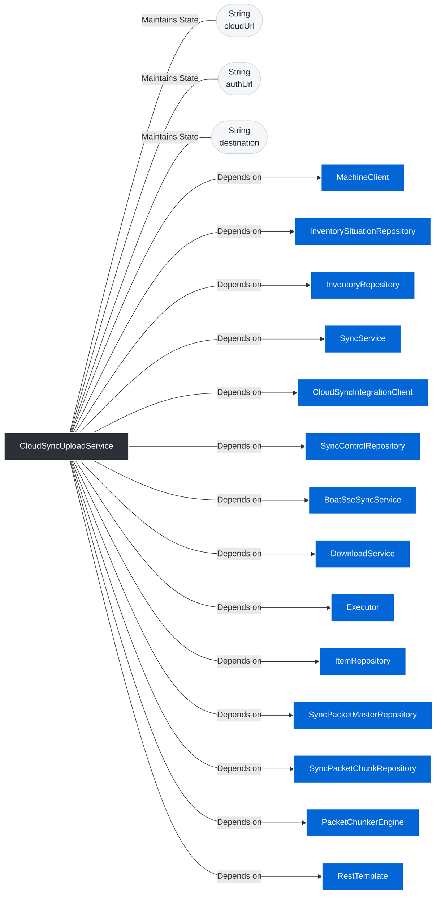

---

## 3. Deep Dive (Constructors & Methods)

### 🛠️ Constructors

<b>CloudSyncUploadService</b>(<i>InventorySituationRepository</i> situationRepository, <i>LocationRepository</i> locationRepository, <i>InventoryRepository</i> inventoryRepository, <i>SyncService</i> musteringBuilderService, <i>CloudSyncIntegrationClient</i> httpClient, <i>SyncControlRepository</i> syncControlRepository, <i>BoatSseSyncService</i> sseSyncService, <i>RestTemplate</i> restTemplate, <i>DownloadService</i> downloadService, <i>ItemRepository</i> itemRepository, <i>PacketChunkerEngine</i> chunkerEngine, <i>SyncPacketChunkRepository</i> syncPacketChunkRepository, <i>SyncPacketMasterRepository</i> syncPacketMasterRepository, <i>Executor</i> parallelSyncExecutor, <i>MachineClient</i> machineClient) (Click to expand)

> **Signature:**
> `public CloudSyncUploadService(InventorySituationRepository situationRepository, LocationRepository locationRepository, InventoryRepository inventoryRepository, SyncService musteringBuilderService, CloudSyncIntegrationClient httpClient, SyncControlRepository syncControlRepository, BoatSseSyncService sseSyncService, RestTemplate restTemplate, DownloadService downloadService, ItemRepository itemRepository, PacketChunkerEngine chunkerEngine, SyncPacketChunkRepository syncPacketChunkRepository, SyncPacketMasterRepository syncPacketMasterRepository, Executor parallelSyncExecutor, MachineClient machineClient)`

**Sequence Diagram:**
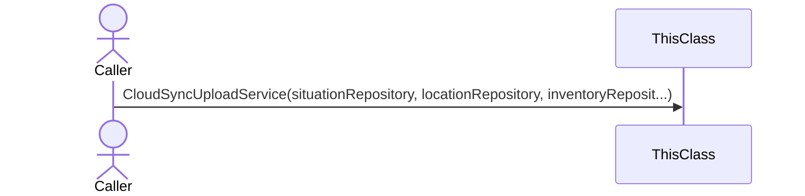

**Step-by-Step Logic:**

1. Set 'this.situationRepository' to 'situationRepository'

1. Set 'this.inventoryRepository' to 'inventoryRepository'

1. Set 'this.musteringBuilderService' to 'musteringBuilderService'

1. Set 'this.httpClient' to 'httpClient'

1. Set 'this.syncControlRepository' to 'syncControlRepository'

1. Set 'this.sseSyncService' to 'sseSyncService'

1. Set 'this.parallelSyncExecutor' to 'parallelSyncExecutor'

1. Set 'this.restTemplate' to 'restTemplate'

1. Set 'this.downloadService' to 'downloadService'

1. Set 'this.itemRepository' to 'itemRepository'

1. Set 'this.machineClient' to 'machineClient'

1. Set 'this.chunkerEngine' to 'chunkerEngine'

1. Set 'this.chunkRepository' to 'syncPacketChunkRepository'

1. Set 'this.masterRepository' to 'syncPacketMasterRepository'

### ⚙️ Methods

<b>setDestination</b>(<i>String</i> destination) ➞ `void` (Click to expand)

> **Signature:**
> `public void setDestination(String destination)`

**Sequence Diagram:**
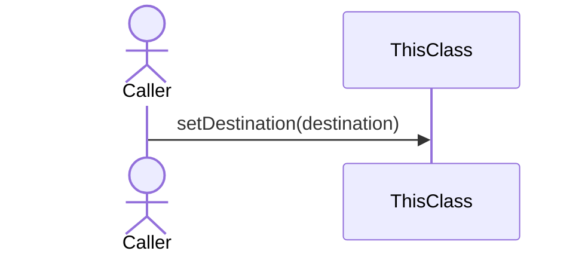

**Step-by-Step Logic:**

1. Set 'this.destination' to 'destination'

<b>latestSync</b>() ➞ `SyncLastestResponse` (Click to expand)

> **Signature:**
> `public SyncLastestResponse latestSync()`

**Sequence Diagram:**
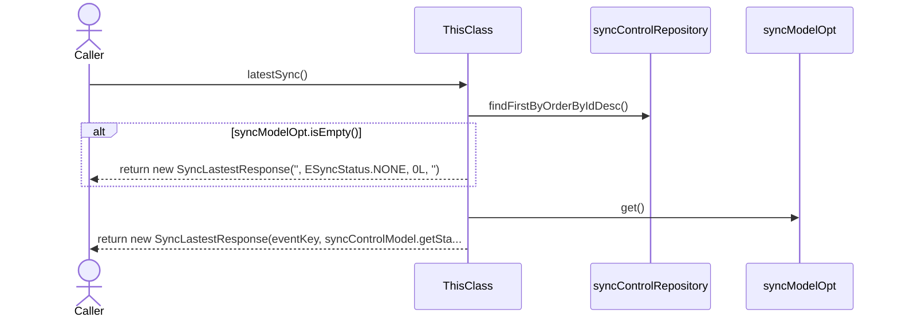

**Step-by-Step Logic:**

1. Declare variable 'syncModelOpt' of type 'Optional<SyncControlModel>' and initialize it with 'Invoke 'syncControlRepository.findFirstByOrderByIdDesc' (no parameters)'

1. If Invoke 'syncModelOpt.isEmpty' (no parameters)
   then:
      - Return the result of: new SyncLastestResponse("", ESyncStatus.NONE, 0L, "")

1. Declare variable 'syncControlModel' of type 'SyncControlModel' and initialize it with 'Invoke 'syncModelOpt.get' (no parameters)'

1. Declare variable 'timestamp' of type 'Long' and initialize it with 'syncControlModel.getLastSyncAt() != null
                ? syncControlModel.getLastSyncAt().toEpochMilli()
                : 0L'

1. Declare variable 'eventKey' of type 'String' and initialize it with 'syncControlModel.getEventKey() != null
                ? syncControlModel.getEventKey().toString()
                : ""'

1. Return the result of: new SyncLastestResponse(eventKey, syncControlModel.getStatus(),
                timestamp, syncControlModel.getErrorMessage())

<b>syncToCloud</b>(<i>SyncRequest</i> request) ➞ `SyncEvent` (Click to expand)

> **Signature:**
> `public SyncEvent syncToCloud(SyncRequest request) throws AppException`

**Sequence Diagram:**
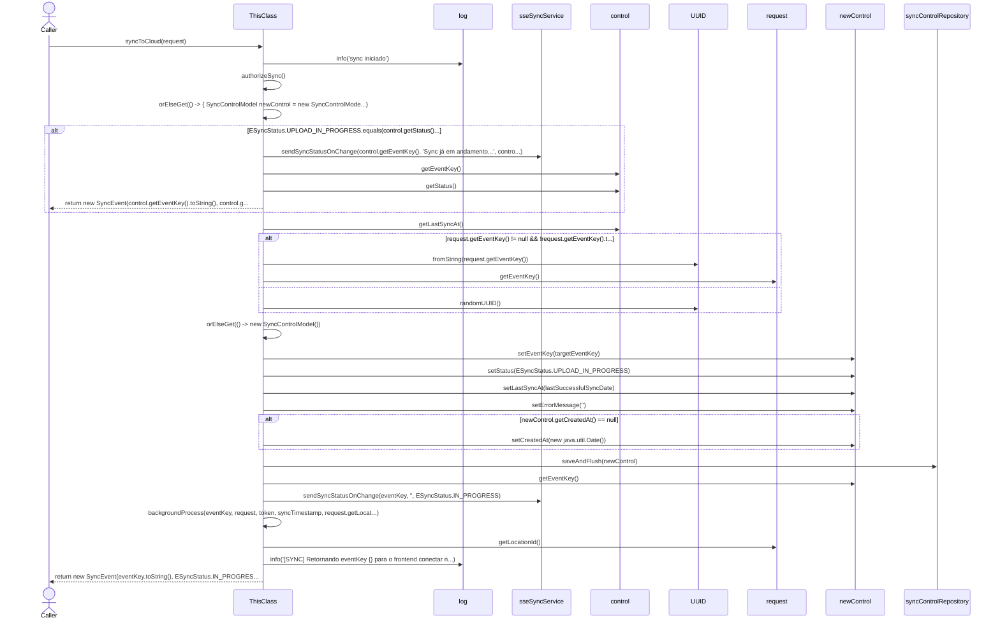

**Step-by-Step Logic:**

1. Invoke 'log.info' with parameters: '"sync iniciado"'

1. Declare variable 'token' of type 'String' and initialize it with 'Invoke 'authorizeSync' (no parameters)'

1. Declare variable 'control' of type 'SyncControlModel' and initialize it with 'Invoke 'Invoke 'syncControlRepository.findFirstByOrderByIdDesc' (no parameters).orElseGet' with parameters: '() -> {
                    SyncControlModel newControl = new SyncControlModel();
                    newControl.setEventKey(UUID.randomUUID());
                    return newControl;
                }''

1. If Invoke 'ESyncStatus.UPLOAD_IN_PROGRESS.equals' with parameters: 'Invoke 'control.getStatus' (no parameters)' || Invoke 'ESyncStatus.DOWNLOAD_IN_PROGRESS.equals' with parameters: 'Invoke 'control.getStatus' (no parameters)' || Invoke 'ESyncStatus.IN_PROGRESS.equals' with parameters: 'Invoke 'control.getStatus' (no parameters)'
   then:
      - Declare variable 'lastSync' of type 'Long' and initialize it with 'control.getLastSyncAt() != null ? control.getLastSyncAt().toEpochMilli() : null'
      - Invoke 'sseSyncService.sendSyncStatusOnChange' with parameters: 'Invoke 'control.getEventKey' (no parameters)', '"Sync já em andamento..."', 'Invoke 'control.getStatus' (no parameters)'
      - Return the result of: new SyncEvent(control.getEventKey().toString(), control.getStatus(), lastSync)

1. Declare variable 'lastSuccessfulSyncDate' of type 'Instant' and initialize it with 'Invoke 'control.getLastSyncAt' (no parameters)'

1. Declare variable 'targetEventKey' of type 'UUID'

1. If Invoke 'request.getEventKey' (no parameters) != null && !request.getEventKey().trim().isEmpty()
   then:
      - Set 'targetEventKey' to 'Invoke 'UUID.fromString' with parameters: 'Invoke 'request.getEventKey' (no parameters)''
   else:
      - Set 'targetEventKey' to 'Invoke 'UUID.randomUUID' (no parameters)'

1. Declare variable 'newControl' of type 'SyncControlModel' and initialize it with 'Invoke 'Invoke 'syncControlRepository.findFirstByEventKeyOrderByIdDesc' with parameters: 'targetEventKey'.orElseGet' with parameters: '() -> new SyncControlModel()''

1. Invoke 'newControl.setEventKey' with parameters: 'targetEventKey'

1. Invoke 'newControl.setStatus' with parameters: 'ESyncStatus.UPLOAD_IN_PROGRESS'

1. Invoke 'newControl.setLastSyncAt' with parameters: 'lastSuccessfulSyncDate'

1. Invoke 'newControl.setErrorMessage' with parameters: '""'

1. If Invoke 'newControl.getCreatedAt' (no parameters) == null
   then:
      - Invoke 'newControl.setCreatedAt' with parameters: 'new java.util.Date()'

1. Invoke 'syncControlRepository.saveAndFlush' with parameters: 'newControl'

1. Declare variable 'eventKey' of type 'UUID' and initialize it with 'Invoke 'newControl.getEventKey' (no parameters)'

1. Declare variable 'syncTimestamp' of type 'Long' and initialize it with 'lastSuccessfulSyncDate != null ? lastSuccessfulSyncDate.toEpochMilli()
                : request.getTimestamp()'

1. Invoke 'sseSyncService.sendSyncStatusOnChange' with parameters: 'eventKey', '""', 'ESyncStatus.IN_PROGRESS'

1. Invoke 'backgroundProcess' with parameters: 'eventKey', 'request', 'token', 'syncTimestamp', 'Invoke 'request.getLocationId' (no parameters)'

1. Invoke 'log.info' with parameters: '"[SYNC] Retornando eventKey {} para o frontend conectar no SSE..."', 'eventKey'

1. Return the result of: new SyncEvent(eventKey.toString(), ESyncStatus.IN_PROGRESS, syncTimestamp)

<b>authorizeSync</b>() ➞ `String` (Click to expand)

> **Signature:**
> `public String authorizeSync()`

**Sequence Diagram:**
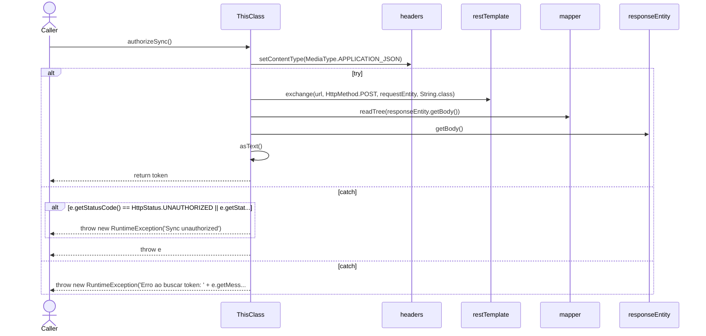

**Step-by-Step Logic:**

1. Declare variable 'req' of type 'AuthRequest' and initialize it with 'new AuthRequest("suporte@cbo.com", "RFIDBrasil")'

1. Declare variable 'url' of type 'String' and initialize it with 'this.destination == null ? authUrl : this.destination + "/auth"'

1. Declare variable 'headers' of type 'HttpHeaders' and initialize it with 'new HttpHeaders()'

1. Invoke 'headers.setContentType' with parameters: 'MediaType.APPLICATION_JSON'

1. Declare variable 'requestEntity' of type 'HttpEntity<?>' and initialize it with 'new HttpEntity<>(req, headers)'

1. Execute a safe block (try) catching potential exceptions

<b>backgroundProcess</b>(<i>UUID</i> eventKey, <i>SyncRequest</i> request, <i>String</i> token, <i>Long</i> syncTimestamp, <i>Long</i> locationId) ➞ `void` (Click to expand)

> **Signature:**
> `private void backgroundProcess(UUID eventKey, SyncRequest request, String token, Long syncTimestamp, Long locationId)`

**Sequence Diagram:**
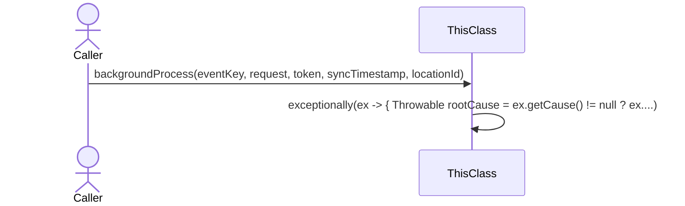

**Step-by-Step Logic:**

1. Invoke 'Invoke 'Invoke 'Invoke 'CompletableFuture.runAsync' with parameters: '() -> {
                    try {
                        processCloudSyncInBackground(eventKey, token, syncTimestamp, locationId);
                    } catch (Exception e) {
                        throw new CompletionException(e);
                    }
                }', 'parallelSyncExecutor'.thenRunAsync' with parameters: '() -> {
                    try {
                        SyncControlModel control = getControlWithRetry(eventKey);
                        control.setStatus(ESyncStatus.DOWNLOAD_IN_PROGRESS);
                        syncControlRepository.save(control);
                        sseSyncService.sendSyncStatusOnChange(eventKey,
                                "Upload concluído. Verificando novidades na Nuvem...",
                                ESyncStatus.DOWNLOAD_IN_PROGRESS);

                        log.info("[SYNC-BACKGROUND] Iniciando Fase 2: DOWNLOAD. Verificando nuvem...");
                        PingSyncResponse ping = httpClient.pingCloud(token, this.destination, syncTimestamp);

                        if (ping != null && ping.isDownloadReady()) {
                            log.info("[SYNC-BACKGROUND] Nuvem sinalizou que há dados. Baixando...");
                            request.setTimestamp(ping.getTimestampToDownload());
                            processDownload(eventKey, request, token, locationId);
                        } else {
                            log.info("[SYNC-BACKGROUND] Nenhuma novidade na nuvem. O barco já está atualizado!");
                        }

                    } catch (Exception e) {
                        throw new CompletionException("Falha na etapa de Download: " + e.getMessage(), e);
                    }
                }', 'parallelSyncExecutor'.thenRun' with parameters: '() -> {
                    SyncControlModel control = getControlWithRetry(eventKey);

                    Instant now = Instant.now();
                    control.setStatus(ESyncStatus.SUCCESS_PENDING);
                    control.setErrorMessage("");
                    control.setLastSyncAt(now);
                    control = syncControlRepository.saveAndFlush(control);
                    sseSyncService.sendSyncStatusOnChange(eventKey, "", ESyncStatus.SUCCESS);

                    boolean sendApiSuccess = sendStatusToApi(eventKey, ESyncStatus.SUCCESS, "", token,
                            now.toEpochMilli(),
                            locationId);
                    boolean sendMachineSuccess = machineClient.sendSuccessSync(
                            this.destination == null ? cloudUrl : this.destination,
                            eventKey.toString(),
                            now.toEpochMilli());
                    if (sendApiSuccess && sendMachineSuccess) {
                        control.setStatus(ESyncStatus.SUCCESS);
                        syncControlRepository.save(control);
                    } else {
                        log.error(
                                "Error ao avisar sucesso para api ou machine, na proxima iteracao do machine havera outra tentativa");
                    }

                }'.exceptionally' with parameters: 'ex -> {
                    Throwable rootCause = ex.getCause() != null ? ex.getCause() : ex;
                    log.error("[SYNC-BACKGROUND] Erro durante a sincronização: {}", rootCause.getMessage(), rootCause);

                    try {
                        SyncControlModel control = getControlWithRetry(eventKey);
                        control.setStatus(ESyncStatus.FAILED_PENDING);
                        String errorMsg = rootCause.getMessage() != null ? rootCause.getMessage() : "Erro desconhecido";
                        control.setErrorMessage(errorMsg.length() > 1000 ? errorMsg.substring(0, 1000) : errorMsg);
                        control = syncControlRepository.saveAndFlush(control);
                        sseSyncService.sendSyncStatusOnChange(eventKey, rootCause.getMessage(), ESyncStatus.FAILED);
                        boolean sendApiStatusSuccessfully = sendStatusToApi(eventKey, ESyncStatus.FAILED,
                                rootCause.getMessage(), token,
                                0L, locationId);

                        if (sendApiStatusSuccessfully) {
                            control.setStatus(ESyncStatus.FAILED);
                            syncControlRepository.save(control);
                        } else {
                            log.error(
                                    "Error ao avisar falha para api, na proxima iteracao do machine havera outra tentativa");
                        }

                    } catch (Exception dbEx) {
                        log.error("[SYNC-BACKGROUND] Falha crítica ao salvar status FAILED: {}", dbEx.getMessage());
                    }
                    return null;
                }'

<b>processDownload</b>(<i>UUID</i> eventKey, <i>SyncRequest</i> request, <i>String</i> token, <i>Long</i> locationId) ➞ `void` (Click to expand)

> **Signature:**
> `private void processDownload(UUID eventKey, SyncRequest request, String token, Long locationId) throws AppException`

**Sequence Diagram:**
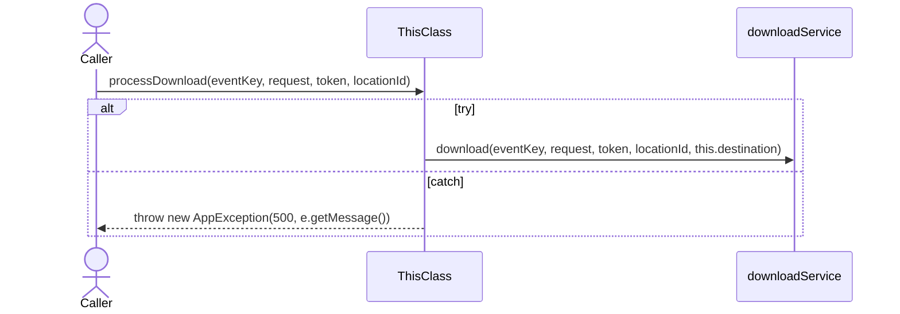

**Step-by-Step Logic:**

1. Execute a safe block (try) catching potential exceptions

<b>getControlWithRetry</b>(<i>UUID</i> eventKey) ➞ `SyncControlModel` (Click to expand)

> **Signature:**
> `private SyncControlModel getControlWithRetry(UUID eventKey)`

**Sequence Diagram:**
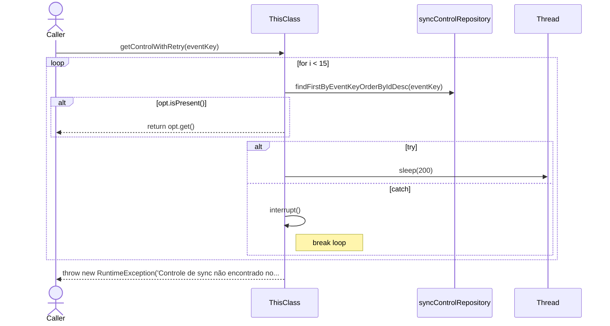

**Step-by-Step Logic:**

1. Start loop (for) initializing 'Declare variable 'i' of type 'int' and initialize it with '0'', continuing while 'i < 15' is true, and updating 'i++'

1. Throw exception: new RuntimeException("Controle de sync não encontrado no banco para a key: " + eventKey)

<b>processCloudSyncInBackground</b>(<i>UUID</i> eventKey, <i>String</i> token, <i>Long</i> syncTimestamp, <i>Long</i> locationId) ➞ `void` (Click to expand)

> **Signature:**
> `private void processCloudSyncInBackground(UUID eventKey, String token, Long syncTimestamp, Long locationId)`

**Sequence Diagram:**
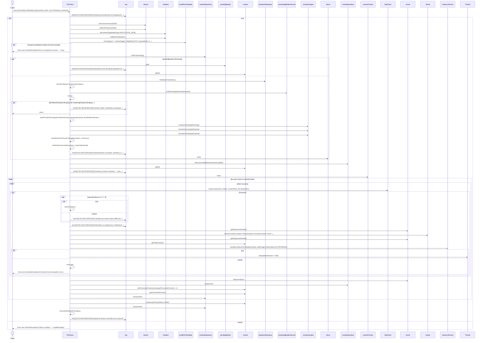

**Step-by-Step Logic:**

1. Invoke 'log.info' with parameters: '"[SYNC-BACKGROUND] Iniciando processamento em background para o eventKey: {}"', 'eventKey'

1. Execute a safe block (try) catching potential exceptions

<b>saveMasterAndChunksToDatabase</b>(<i>List<byte[]></i> slices, <i>String</i> checksum) ➞ `SyncPacketMaster` (Click to expand)

> **Signature:**
> `private SyncPacketMaster saveMasterAndChunksToDatabase(List<byte[]> slices, String checksum)`

**Sequence Diagram:**
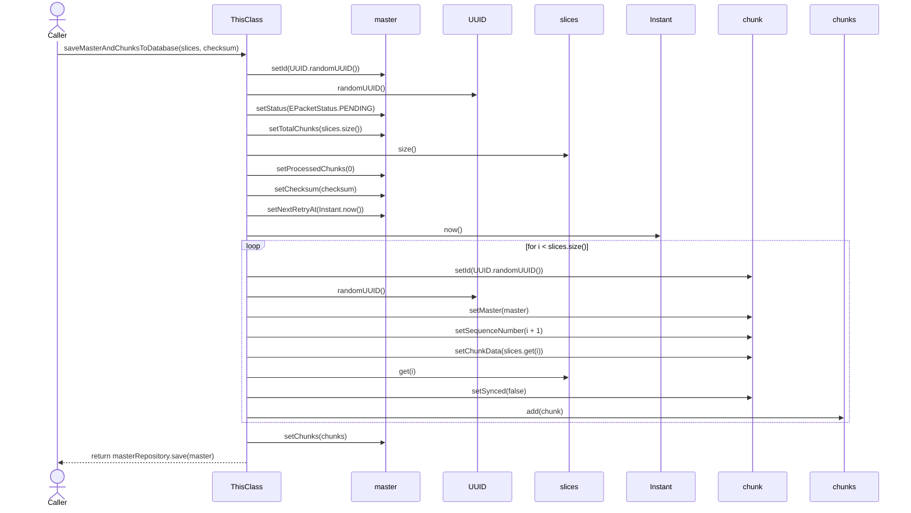

**Step-by-Step Logic:**

1. Declare variable 'master' of type 'SyncPacketMaster' and initialize it with 'new SyncPacketMaster()'

1. Invoke 'master.setId' with parameters: 'Invoke 'UUID.randomUUID' (no parameters)'

1. Invoke 'master.setStatus' with parameters: 'EPacketStatus.PENDING'

1. Invoke 'master.setTotalChunks' with parameters: 'Invoke 'slices.size' (no parameters)'

1. Invoke 'master.setProcessedChunks' with parameters: '0'

1. Invoke 'master.setChecksum' with parameters: 'checksum'

1. Invoke 'master.setNextRetryAt' with parameters: 'Invoke 'Instant.now' (no parameters)'

1. Declare variable 'chunks' of type 'List<SyncPacketChunk>' and initialize it with 'new ArrayList<>()'

1. Start loop (for) initializing 'Declare variable 'i' of type 'int' and initialize it with '0'', continuing while 'i < Invoke 'slices.size' (no parameters)' is true, and updating 'i++'

1. Invoke 'master.setChunks' with parameters: 'chunks'

1. Return the result of: Invoke 'masterRepository.save' with parameters: 'master'

<b>cleanupOldUploadPackages</b>() ➞ `void` (Click to expand)

> **Signature:**
> `private void cleanupOldUploadPackages()`

**Sequence Diagram:**
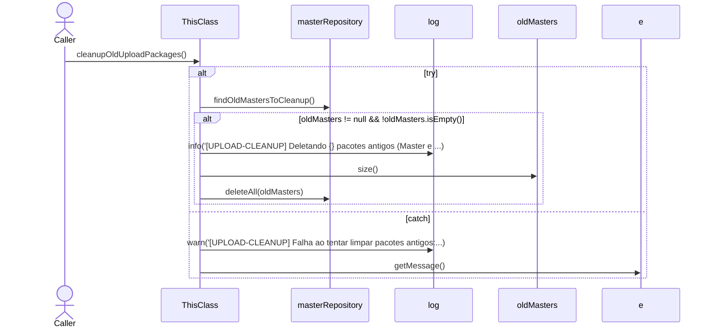

**Step-by-Step Logic:**

1. Execute a safe block (try) catching potential exceptions

<b>buildProtobufPackage</b>(<i>List<ItemStatusSyncDTO></i> status, <i>List<MusteringSyncDTO></i> mustering, <i>List<ItemModificationStatusDTO></i> modifications) ➞ `SyncPackage` (Click to expand)

> **Signature:**
> `private SyncPackage buildProtobufPackage(List<ItemStatusSyncDTO> status, List<MusteringSyncDTO> mustering, List<ItemModificationStatusDTO> modifications)`

**Sequence Diagram:**
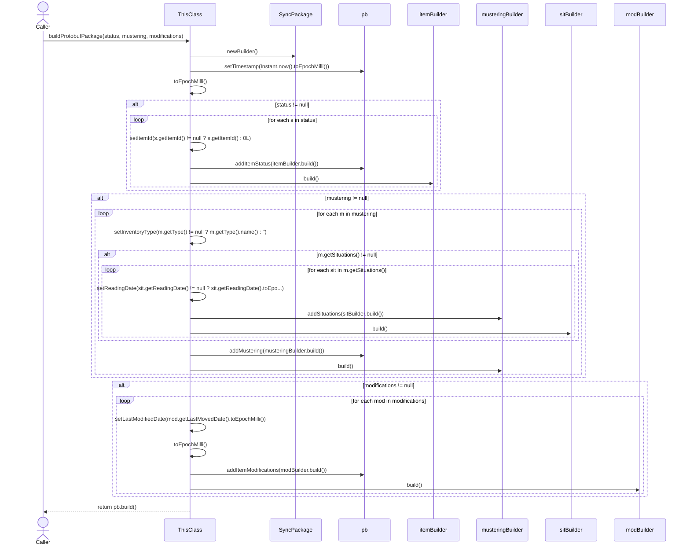

**Step-by-Step Logic:**

1. Declare variable 'pb' of type 'SyncPackage.Builder' and initialize it with 'Invoke 'SyncPackage.newBuilder' (no parameters)'

1. Invoke 'pb.setTimestamp' with parameters: 'Invoke 'Invoke 'Instant.now' (no parameters).toEpochMilli' (no parameters)'

1. If status != null
   then:
      - Loop through each 's' in the collection 'status'

1. If mustering != null
   then:
      - Loop through each 'm' in the collection 'mustering'

1. If modifications != null
   then:
      - Loop through each 'mod' in the collection 'modifications'

1. Return the result of: Invoke 'pb.build' (no parameters)

<b>sendStatusToApi</b>(<i>UUID</i> eventKey, <i>ESyncStatus</i> status, <i>String</i> message, <i>String</i> token, <i>Long</i> timestamp, <i>Long</i> locationId) ➞ `boolean` (Click to expand)

> **Signature:**
> `public boolean sendStatusToApi(UUID eventKey, ESyncStatus status, String message, String token, Long timestamp, Long locationId)`

**Sequence Diagram:**
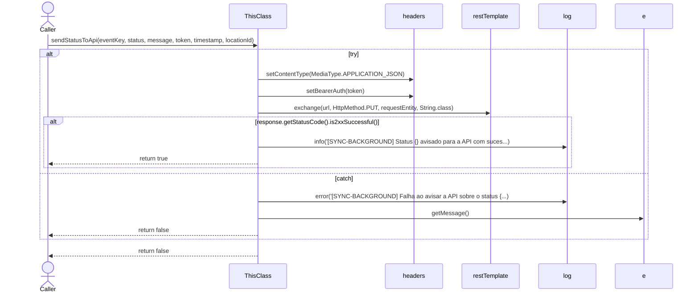

**Step-by-Step Logic:**

1. Execute a safe block (try) catching potential exceptions

1. Return the result of: false

<b>fetchItemStatusTransitions</b>(<i>List<ItemStatusTransitionProjection></i> transitions) ➞ `List<ItemStatusSyncDTO>` (Click to expand)

> **Signature:**
> `private List<ItemStatusSyncDTO> fetchItemStatusTransitions(List<ItemStatusTransitionProjection> transitions)`

**Sequence Diagram:**
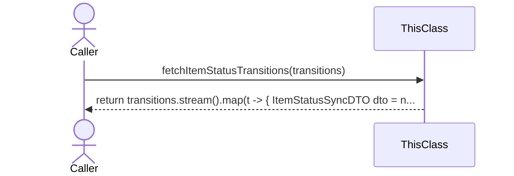

**Step-by-Step Logic:**

1. Return the result of: Invoke 'Invoke 'Invoke 'transitions.stream' (no parameters).map' with parameters: 't -> {
            ItemStatusSyncDTO dto = new ItemStatusSyncDTO();
            dto.setEpc(t.getEpc());
            dto.setStatus(t.getSituation());
            dto.setReadingDate(t.getReadingDate());
            dto.setAntennaNumber(t.getAntennaNumber());
            dto.setPortalMac(t.getPortalMac());
            dto.setInventoryId(t.getInventoryId());
            dto.setItemId(t.getItemId());
            return dto;
        }'.collect' with parameters: 'Invoke 'Collectors.toList' (no parameters)'

<b>markDataAsSynced</b>(<i>List<ItemStatusTransitionProjection></i> transitions, <i>List<MusteringSyncDTO></i> musterings) ➞ `void` (Click to expand)

> **Signature:**
> `private void markDataAsSynced(List<ItemStatusTransitionProjection> transitions, List<MusteringSyncDTO> musterings)`

**Sequence Diagram:**
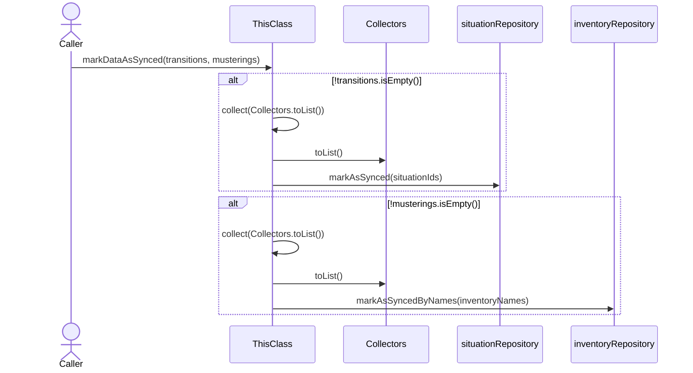

**Step-by-Step Logic:**

1. If !transitions.isEmpty()
   then:
      - Declare variable 'situationIds' of type 'List<Long>' and initialize it with 'Invoke 'Invoke 'Invoke 'transitions.stream' (no parameters).map' with parameters: 'ItemStatusTransitionProjection::getId'.collect' with parameters: 'Invoke 'Collectors.toList' (no parameters)''
      - Invoke 'situationRepository.markAsSynced' with parameters: 'situationIds'

1. If !musterings.isEmpty()
   then:
      - Declare variable 'inventoryNames' of type 'List<String>' and initialize it with 'Invoke 'Invoke 'Invoke 'musterings.stream' (no parameters).map' with parameters: 'MusteringSyncDTO::getInventoryName'.collect' with parameters: 'Invoke 'Collectors.toList' (no parameters)''
      - Invoke 'inventoryRepository.markAsSyncedByNames' with parameters: 'inventoryNames'

