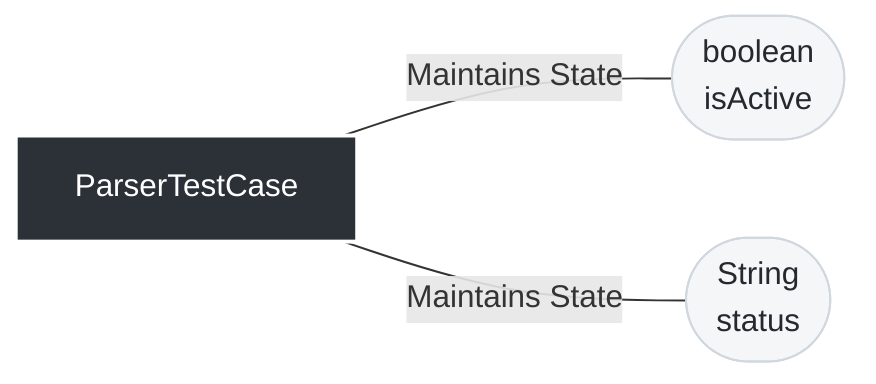
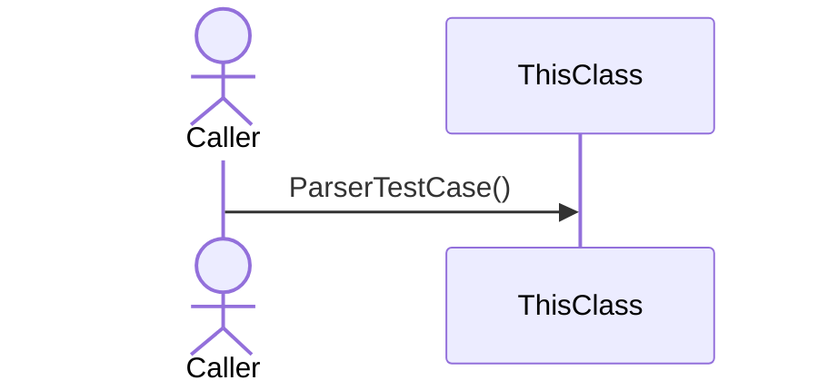
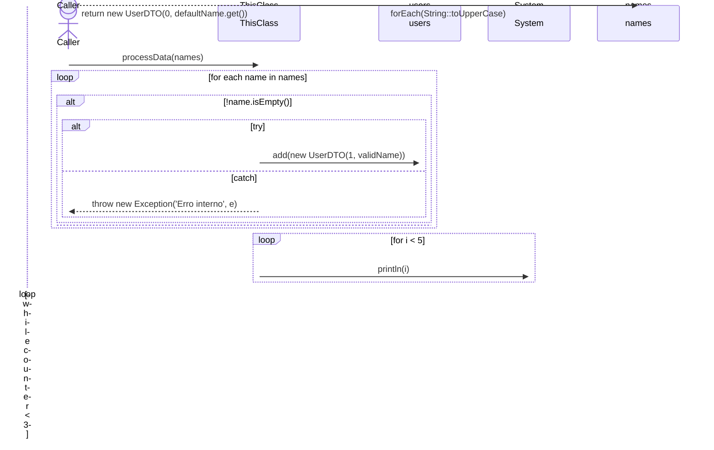

# 📄 Technical Specification: `ParserTestCase`

> **Package:** parser
> **Dependencies (Imports):**
> - java.util.ArrayList
> - java.util.List
> - java.util.function.Supplier
> **Automatically generated documentation** by the Geanky tool.

---

## 1. Quick Summary (API & State)
A high-level overview of the class, its internal state, and available methods.

**Internal State & Dependencies:**

- `private ` **isActive** (`boolean`)

- `private ` **status** (`String`)

**Available Methods:**
- **processData(List<String> names)** ➞ returns `UserDTO` (throws Exception)

---

## 2. Class Dependencies & State
Visual representation of the internal state and external dependencies this class maintains.

---

## 3. Deep Dive (Constructors & Methods)

### 🛠️ Constructors

<b>ParserTestCase</b>() (Click to expand)

> **Signature:**
> `public ParserTestCase()`

**Sequence Diagram:**

**Step-by-Step Logic:**

1. Set 'this.isActive' to 'false'

### ⚙️ Methods

<b>processData</b>(<i>List<String></i> names) ➞ `UserDTO` (Click to expand)

> **Signature:**
> `public UserDTO processData(List<String> names) throws Exception`

**Sequence Diagram:**

**Step-by-Step Logic:**

1. Declare variable 'users' of type 'List<UserDTO>' and initialize it with 'new ArrayList<>()'

1. Loop through each 'name' in the collection 'names'

1. Start loop (for) initializing 'Declare variable 'i' of type 'int' and initialize it with '0'', continuing while 'i < 5' is true, and updating 'i++'

1. Declare variable 'counter' of type 'int' and initialize it with '0'

1. Start loop (while) as long as 'counter < 3' is true

1. Declare variable 'defaultName' of type 'Supplier<String>' and initialize it with '() -> "Default"'

1. Invoke 'names.forEach' with parameters: 'String::toUpperCase'

1. Return the result of: new UserDTO(0, defaultName.get())

