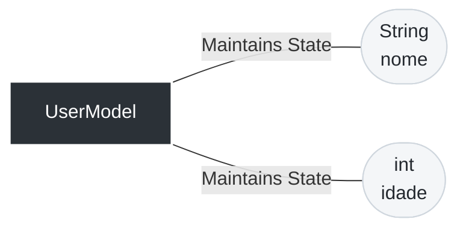
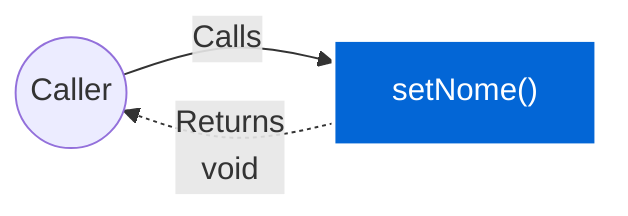
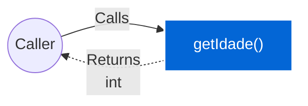
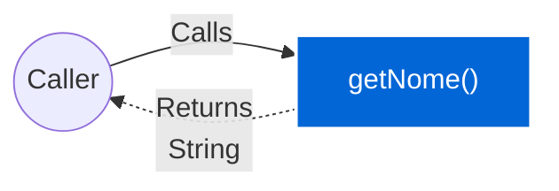

# 📄 Technical Specification: `UserModel`

> **Package:** models
> **Automatically generated documentation** by the Geanky tool.

---

## 1. Quick Summary (API & State)
A high-level overview of the class, its internal state, and available methods.

**Internal State & Dependencies:**

- `private ` **nome** (`String`)

- `private ` **idade** (`int`)

**Available Methods:**
- **setNome(String nome)** ➞ returns `void`
- **setIdade(int idade)** ➞ returns `void`
- **getIdade()** ➞ returns `int`
- **getNome()** ➞ returns `String`

---

## 2. Class Dependencies & State
Visual representation of the internal state and external dependencies this class maintains.

---

## 3. Deep Dive (Constructors & Methods)
Expand the sections below to read the exact pseudo-code and business rules.

### 🛠️ Constructors

<b>UserModel</b>(<i>String</i> nome, <i>int</i> idade) (Click to expand)

> **Signature:**
> `public UserModel(String nome, int idade)`

**Parameters:**

- **nome** (`String`)

- **idade** (`int`)

**Step-by-Step Logic:**

1. Set &#39;this.nome&#39; to &#39;nome&#39;

1. Set &#39;this.idade&#39; to &#39;idade&#39;

### ⚙️ Methods

<b>setNome</b>(<i>String</i> nome) ➞ `void` (Click to expand)

> **Signature:**
> `public void setNome(String nome)`

**Data Flow:**

**Parameters:**

- **nome** (`String`)

**Step-by-Step Logic:**

1. Set &#39;this.nome&#39; to &#39;nome&#39;

<b>setIdade</b>(<i>int</i> idade) ➞ `void` (Click to expand)

> **Signature:**
> `public void setIdade(int idade)`

**Data Flow:**

**Parameters:**

- **idade** (`int`)

**Step-by-Step Logic:**

1. Set &#39;this.idade&#39; to &#39;idade&#39;

<b>getIdade</b>() ➞ `int` (Click to expand)

> **Signature:**
> `public int getIdade()`

**Data Flow:**

**Parameters:**
> *None.*

**Step-by-Step Logic:**

1. Return the result of: this.idade

<b>getNome</b>() ➞ `String` (Click to expand)

> **Signature:**
> `public String getNome()`

**Data Flow:**

**Parameters:**
> *None.*

**Step-by-Step Logic:**

1. Return the result of: this.nome

