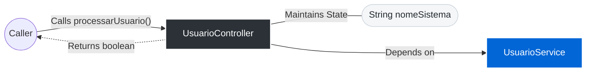

# 📄 Technical Specification: `UsuarioController`

> **Package:** controllers
> **Dependencies (Imports):**
> - internal.testadata.java.models.UserModel
> - internal.testadata.java.services.UsuarioService
> **Automatically generated documentation** by the Geanky tool.

---

## 1. Quick Summary (API & State)
A high-level overview of the class, its internal state, and available methods.

**Internal State & Dependencies:**

- `private ` **nomeSistema** (`String`)

- `private ` **service** ([UsuarioService](UsuarioService.md)) 🔗

**Available Methods:**
- **processarUsuario(UserModel userModel, String status)** ➞ returns `boolean`

---

## 2. Architecture & Data Flow Diagram
Visual representation of how data enters the class, internal state, and external dependencies.

---

## 3. Deep Dive (Constructors & Methods)
Expand the sections below to read the exact pseudo-code and business rules.

### 🛠️ Constructors

<b>UsuarioController</b>(<i>String</i> nomeSistema, <i>UsuarioService</i> service) (Click to expand)

**Parameters:**

- **nomeSistema** (`String`)

- **service** (`UsuarioService`)

**Step-by-Step Logic:**

1. Set 'this.nomeSistema' to 'nomeSistema'

1. Set 'this.service' to 'service'

### ⚙️ Methods

<b>processarUsuario</b>(<i>UserModel</i> userModel, <i>String</i> status) ➞ `boolean` (Click to expand)

> **Signature:** `public boolean processarUsuario(UserModel userModel, String status)`

**Parameters:**

- **userModel** (`UserModel`)

- **status** (`String`)

**Step-by-Step Logic:**

1. If Invoke 'this.service.validarEAtivarUsuario' with parameters: 'Invoke 'userModel.getIdade' (no parameters)', 'status'
   then:
      - Invoke 'this.service.registrarLog' with parameters: '"Processo concluido no sistema " plus this.nomeSistema'
      - Return the result of: true

1. Return the result of: false

