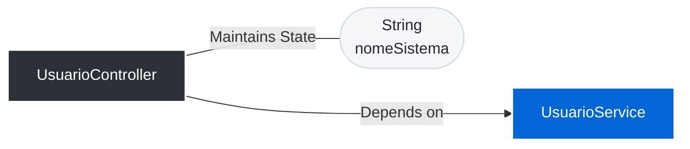
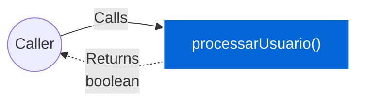

# 📄 Technical Specification: `UsuarioController`

> **Package:** controllers
> **Dependencies (Imports):**
> - [internal.testadata.java.models.UserModel](UserModel.md) 🔗
> - [internal.testadata.java.services.UsuarioService](UsuarioService.md) 🔗
> **Automatically generated documentation** by the Geanky tool.

---

## 1. Quick Summary (API & State)
A high-level overview of the class, its internal state, and available methods.

**Internal State & Dependencies:**

- `private ` **nomeSistema** (`String`)

- `private ` **service** ([UsuarioService](UsuarioService.md)) 🔗

**Available Methods:**
- **processarUsuario(UserModel userModel, String status)** ➞ returns `boolean`

---

## 2. Class Dependencies & State
Visual representation of the internal state and external dependencies this class maintains.

---

## 3. Deep Dive (Constructors & Methods)
Expand the sections below to read the exact pseudo-code and business rules.

### 🛠️ Constructors

<b>UsuarioController</b>(<i>String</i> nomeSistema, <i>UsuarioService</i> service) (Click to expand)

> **Signature:**
> `public UsuarioController(String nomeSistema, UsuarioService service)`

**Parameters:**

- **nomeSistema** (`String`)

- **service** (`UsuarioService`)

**Step-by-Step Logic:**

1. Set &#39;this.nomeSistema&#39; to &#39;nomeSistema&#39;

1. Set &#39;this.service&#39; to &#39;service&#39;

### ⚙️ Methods

<b>processarUsuario</b>(<i>UserModel</i> userModel, <i>String</i> status) ➞ `boolean` (Click to expand)

> **Signature:**
> `public boolean processarUsuario(UserModel userModel, String status)`

**Data Flow:**

**Parameters:**

- **userModel** (`UserModel`)

- **status** (`String`)

**Step-by-Step Logic:**

1. If Invoke &#39;this.service.validarEAtivarUsuario&#39; with parameters: &#39;Invoke &#39;userModel.getIdade&#39; (no parameters)&#39;, &#39;status&#39;
   then:
      - Invoke &#39;this.service.registrarLog&#39; with parameters: &#39;&#34;Processo concluido no sistema &#34; plus this.nomeSistema&#39;
      - Return the result of: true

1. Return the result of: false

