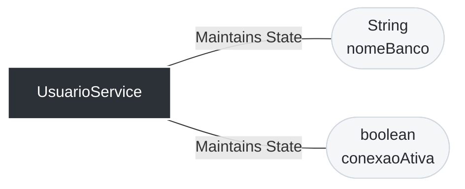
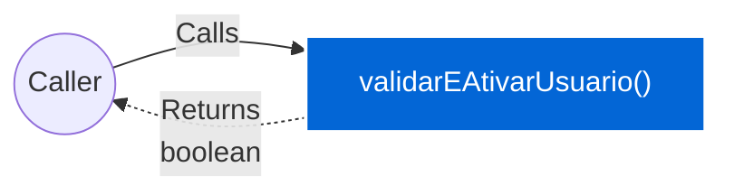
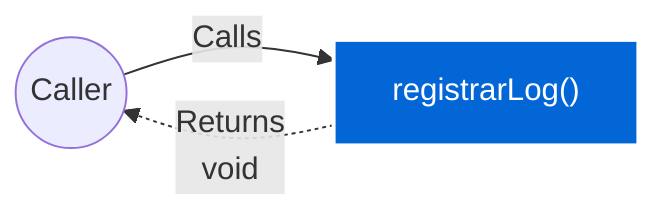

# 📄 Technical Specification: `UsuarioService`

> **Package:** services
> **Automatically generated documentation** by the Geanky tool.

---

## 1. Quick Summary (API & State)
A high-level overview of the class, its internal state, and available methods.

**Internal State & Dependencies:**

- `private ` **nomeBanco** (`String`)

- `private ` **conexaoAtiva** (`boolean`)

**Available Methods:**
- **validarEAtivarUsuario(int idade, String status)** ➞ returns `boolean`
- **registrarLog(String acao)** ➞ returns `void`

---

## 2. Class Dependencies & State
Visual representation of the internal state and external dependencies this class maintains.

---

## 3. Deep Dive (Constructors & Methods)
Expand the sections below to read the exact pseudo-code and business rules.

### 🛠️ Constructors

<b>UsuarioService</b>(<i>String</i> nomeBanco) (Click to expand)

> **Signature:**
> `public UsuarioService(String nomeBanco)`

**Parameters:**

- **nomeBanco** (`String`)

**Step-by-Step Logic:**

1. Set &#39;this.nomeBanco&#39; to &#39;nomeBanco&#39;

1. Set &#39;this.conexaoAtiva&#39; to &#39;true&#39;

### ⚙️ Methods

<b>validarEAtivarUsuario</b>(<i>int</i> idade, <i>String</i> status) ➞ `boolean` (Click to expand)

> **Signature:**
> `public boolean validarEAtivarUsuario(int idade, String status)`

**Data Flow:**

**Parameters:**

- **idade** (`int`)

- **status** (`String`)

**Step-by-Step Logic:**

1. If idade is greater than or equal to 18 AND status is equal to &#34;ativo&#34;
   then:
      - Invoke &#39;System.out.println&#39; with parameters: &#39;&#34;Usuario validado com sucesso no banco &#34; plus this.nomeBanco&#39;
      - Return the result of: true

1. Invoke &#39;System.out.println&#39; with parameters: &#39;&#34;Falha na validacao&#34;&#39;

1. Return the result of: false

<b>registrarLog</b>(<i>String</i> acao) ➞ `void` (Click to expand)

> **Signature:**
> `public void registrarLog(String acao)`

**Data Flow:**

**Parameters:**

- **acao** (`String`)

**Step-by-Step Logic:**

1. Set &#39;this.conexaoAtiva&#39; to &#39;false&#39;

1. Invoke &#39;System.out.println&#39; with parameters: &#39;acao&#39;

