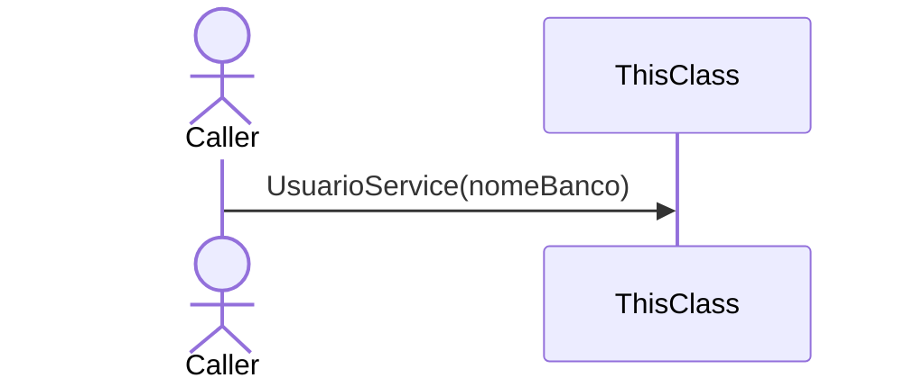
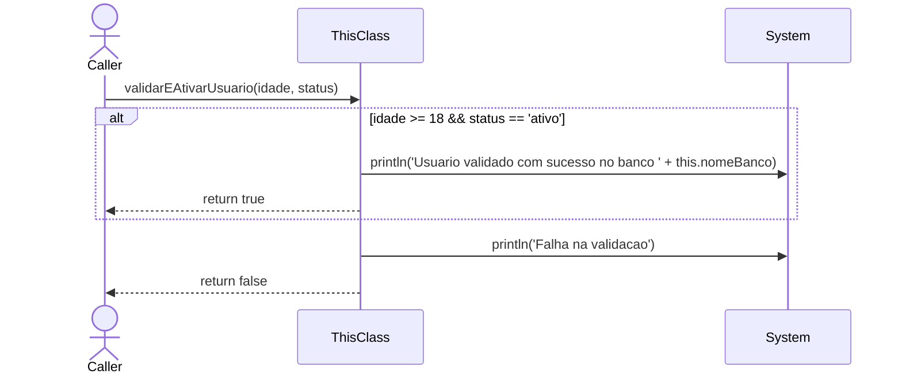
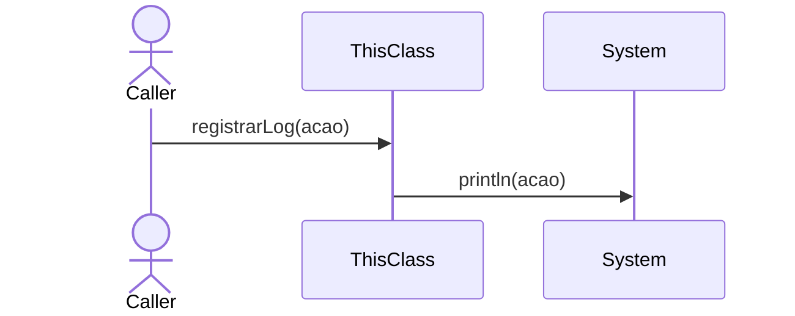

# 📄 Technical Specification: `UsuarioService`

> **Package:** services
> **Automatically generated documentation** by the Geanky tool.

---

## 1. Quick Summary (API & State)
A high-level overview of the class, its internal state, and available methods.

**Internal State & Dependencies:**

- `private ` **nomeBanco** (`String`)

- `private ` **conexaoAtiva** (`boolean`)

**Available Methods:**
- **validarEAtivarUsuario(int idade, String status)** ➞ returns `boolean`
- **registrarLog(String acao)** ➞ returns `void`

---

## 2. Class Dependencies & State
Visual representation of the internal state and external dependencies this class maintains.

---

## 3. Deep Dive (Constructors & Methods)

### 🛠️ Constructors

<b>UsuarioService</b>(<i>String</i> nomeBanco) (Click to expand)

> **Signature:**
> `public UsuarioService(String nomeBanco)`

**Sequence Diagram:**

**Step-by-Step Logic:**

1. Set 'this.nomeBanco' to 'nomeBanco'

1. Set 'this.conexaoAtiva' to 'true'

### ⚙️ Methods

<b>validarEAtivarUsuario</b>(<i>int</i> idade, <i>String</i> status) ➞ `boolean` (Click to expand)

> **Signature:**
> `public boolean validarEAtivarUsuario(int idade, String status)`

**Sequence Diagram:**

**Step-by-Step Logic:**

1. If idade >= 18 && status == "ativo"
   then:
      - Invoke 'System.out.println' with parameters: '"Usuario validado com sucesso no banco " + this.nomeBanco'
      - Return the result of: true

1. Invoke 'System.out.println' with parameters: '"Falha na validacao"'

1. Return the result of: false

<b>registrarLog</b>(<i>String</i> acao) ➞ `void` (Click to expand)

> **Signature:**
> `public void registrarLog(String acao)`

**Sequence Diagram:**

**Step-by-Step Logic:**

1. Set 'this.conexaoAtiva' to 'false'

1. Invoke 'System.out.println' with parameters: 'acao'

